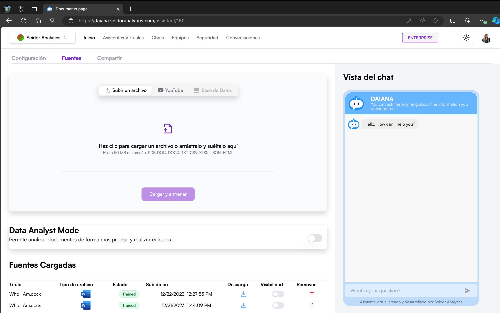
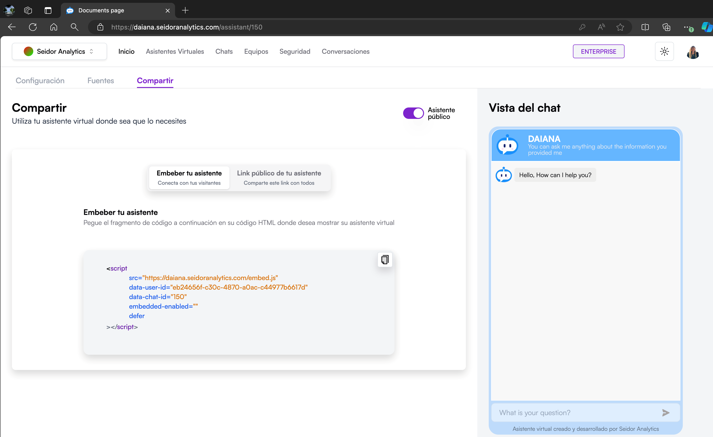

  
The Virtual Assistants screen in Seidor Analytics allows users to view, search, and manage the virtual assistants available on the platform. This screen offers a card view of virtual assistants, each providing key information and direct access to specific functionalities.

**Screen Components**

**1) Top Navigation Bar:**

-   **Tenant:** Identification of the Tenant associated with the logged-in user.
-   **Navigation Menu:** Includes the Home, Virtual Assistants, Chats, Teams, Security, and Conversations sections.
-   **Plan Indicator:** Shows the user's current plan (e.g., Enterprise).
-   **Theme Icon:** Access to platform theme types (e.g., Dark).
-   **User Profile:** Access to profile settings and user options.

**2) Virtual Assistants Header:**

-   **Title:** “Virtual assistants” indicating the current section of the platform.
-   **“New virtual assistant” Button:** Allows the creation of a new virtual assistant.
-   **“Assisted Creation” Button:** With a quick guide, allows the creation of a new Database or SAP virtual assistant.

**3) Search Bar and Filters:**

-   **Search Field:** Text box where users can enter terms to search for specific virtual assistants.
-   **Category Filters:** Filter buttons allowing the user to classify virtual assistants by different categories (e.g., Human Resources, Commercial, Marketing, etc.).

**4) Virtual Assistant Cards:**

each virtual assistant is represented by a card including the following information:

-   **Assistant Name:** Title at the top of the card.
-   **Brief Description:** Text indicating the main functionality of the assistant.
-   **Category:** Label indicating the assistant's application area (e.g., Commercial, Marketing, etc.).
-   **Team**: Name of the team the virtual assistant belongs to.
-   **Contact:** Email address of the person responsible for the assistant.
-   **Creation Date:** Date the assistant was created.
-   **Functionality Icons:** Quick access to edit or manage the assistant.

## **Procedures and Functionalities**

**1) Create a New Virtual Assistant:**

-   Click the “New virtual assistant” button.
-   Complete the form with the required information and save to create the new assistant.

**2) Assisted Creation of a New Virtual Assistant:**

-   Click the “Assisted Creation” button.
-   Select "SAP Assistant" or "DB Assistant".
-   Complete the quick guide and save to create the new assistant.

**3) Search for a Virtual Assistant:**

-   Enter keywords in the search field to locate specific assistants.
-   Use category filters to refine search results.

**4) Edit a Virtual Assistant:**

-   Use the settings icon on the assistant card and select “Edit Assistant” to modify the virtual assistant's information or configuration.

**5) Delete a Virtual Assistant:**

-   Use the settings icon on the assistant card and select “Delete Assistant” to delete the virtual assistant.

**6) Manage Assistants by Category**

-   Click on one of the category filters to view all virtual assistants in that specific category.

## **Procedure to create a Virtual Assistant, upload documents and chat**

### **1) Create a Virtual Assistant**

A) Access the Virtual Assistants Section

-   From the top navigation bar, select “Virtual Assistants”.

B) Create a New Assistant:

-   Click the “New virtual assistant” button.

C) Configure the Assistant:

-   **Assistant Name:** Enter a unique name for the assistant in the corresponding field.
-   **Team**: Select the team the assistant will belong to from the dropdown.
-   **Description**: Provide a brief description of the assistant's functions and capabilities.
-   **Connection Type**: Select the knowledge base the assistant will use from the dropdown.
-   **LLM Provider**: Select the provider the assistant will use.
-   **Assistant Avatar**: Click “Upload Image” to upload an image representing the assistant (allowed formats: JPG, PNG, WEBP, SVG, max size 5 MB).
-   **Chat Theme Color**: Select a color for the assistant's chat theme.

D) Create the Assistant:

-   Review the chat preview in the right panel to ensure the configuration is as desired.
-   Click the “Create Assistant” button to save the configuration and create the new virtual assistant.

### **2) Connect the Virtual Assistant to a Database.**

A) Access the Sources Section

-   In the assistant configuration screen, navigate to the “Sources” tab.

B) Select Connection Type:

-   Select the “Database” option in the information sources.

C) Configure Database Connection:

-   **Database Type**: Select the database type from the dropdown. Supported databases: PostgreSQL, Snowflake, MySQL, SQL Server, Amazon Redshift, SAP Hana.
-   **Host**: Enter your database host.
-   **Schema**: Enter your database schema.
-   **User**: Enter your database user.
-   **Port**: Enter your database port.
-   **Name**: Enter the username to connect to the database.
-   **Password**: Enter the password associated with the database user.

D) Connect and Train:

-   After entering connection details, click the "Connect and train" button for the assistant to connect to the database and train with the provided information. It should be clarified that this step corresponds to a basic training process. For more advanced training, specific technical advisory support is recommended.

### **3) Upload Documents to the Virtual Assistant**

A) Access the Sources Section:

-   In the assistant configuration screen, navigate to the “Sources” tab.

B) Upload a New Document:

-   Select the source type you wish to upload (e.g., File).
-   Drag and drop the file into the designated area or click the area to select a file from your device (up to 50 MB, allowed formats: PDF, DOC, DOCX, TXT, CSV, XLSX, JSON, HTML).
-   Click the “Upload and train” button to start the upload and training process of the assistant with the new sources.

C) Manage Uploaded Sources:

-   Review the list of uploaded sources in the table.
-   Use download icons to download files, visibility switches to control assistant access to files, and trash icons to delete unwanted files.

### **4) Chat with the Virtual Assistant**

A) Access the Chats Section:

-   From the top navigation bar, select “Chats”.

B) Select Team and Assistant:

-   Use the left panel to select the Team the assistant belongs to.
-   Use the left panel to choose the virtual assistant you wish to chat with.

C) Start a Conversation

-   In the conversation window, type your message in the message input field at the bottom.
-   Press the Enter key or click the send icon to send your message to the virtual assistant.
-   Virtual assistant responses will appear in the conversation window. You can view the interaction history in this area for reference.

# New Virtual Assistant

  
The Virtual Assistant Creation screen in Daiana allows users to configure and customize new virtual assistants that can interact with end users. This screen includes options to customize the assistant's appearance and behavior, as well as the connection to a knowledge base.

### **Screen Components**

**1) Top Navigation Bar:**

-   **Tenant:** Identification of the Tenant associated with the logged-in user.
-   **Navigation Menu:** Includes the Home, Virtual Assistants, Chats, Teams, Security, and Conversations sections.
-   **Plan Indicator:** Shows the user's current plan (e.g., Enterprise).
-   **Theme Icon:** Access to platform theme types (e.g., Dark).
-   **User Profile:** Access to profile settings and user options.

**2) Assistant Configuration Section:**

-   **Assistant Name:** Field to assign a unique name to the virtual assistant.
-   **Team:** Dropdown to select the team the assistant will belong to.
-   **Description:** Field to provide a brief description of the assistant's functions.
-   **Connection Type:** Dropdown to select the knowledge base the assistant will use.
-   **LLM Provider**: Dropdown to select the provider the assistant will use.
-   **Assistant Avatar:** Option to upload a custom image representing the assistant (allowed formats: JPG, PNG, WEBP, SVG, max size 5 MB).
-   **Chat Theme Color**: Buttons to select the color for the assistant's chat theme.

**3) Chat View:**

-   **Preview:** Right panel showing a real-time preview of how the virtual assistant and chat will look.

**4) Creation Button:**

-   **Create Assistant:** Purple button that saves the configuration and creates the new virtual assistant.

### **Procedures and Functionalities**

**1) Assign an Assistant Name:**

-   Enter a unique name in the "Assistant Name" field.

**2) Select a Team:**

-   Use the "Team" dropdown to select the team the assistant will belong to.

**3) Provide a Description:**

-   Write a brief description of the assistant's functions and capabilities in the "Description" field.

**4) Configure Knowledge Base:**

-   Use the "Connection Type" dropdown to select the knowledge base the assistant will use.

5) **Configure LLM Provider**:

-   Use the dropdown and select the provider the assistant will use.

**5) Customize Assistant Avatar:**

-   Click "Upload Image" to upload an image representing the assistant. Ensure the image meets format and size requirements.

**6) Select Chat Theme Color:**

-   Choose a color for the assistant's chat theme by selecting one of the available options.

**7) Chat Preview:**

-   Revise the chat preview in the right panel to ensure the configuration is as desired.

**8) Create Virtual Assistant:**

-   After configuring all parameters, click the "Create Assistant" button to save the configuration and create the new virtual assistant.

# Sources

The Sources screen in Seidor Analytics allows users to upload, train, and manage information sources that virtual assistants will use to answer questions and provide support. This screen includes options to upload files, activate data analysis mode, and view already uploaded sources.

## **Screen Components**

### **1) Top Navigation Bar:**

-   **Tenant:** Identification of the Tenant associated with the logged-in user.
-   **Navigation Menu:** Includes the Home, Virtual Assistants, Chats, Teams, Security, and Conversations sections.
-   **Plan Indicator:** Shows the user's current plan (e.g., Enterprise).
-   **Theme Icon:** Access to platform theme types (e.g., Dark).
-   **User Profile:** Access to profile settings and user options.

### **2) File Upload Section**

-   **Source Options:** Buttons to select the source type to upload (e.g., File, YouTube, Database).
-   **File Upload Area:** Zone where users can drag and drop files or click to select files from their device (up to 50 MB, allowed formats: PDF, DOC, DOCX, TXT, CSV, XLSX, JSON, HTML).
-   **Upload and Train Button:** Purple button starting the upload and training process of the assistant with new sources.

### **3) Uploaded Sources Section:**

**Source List:** Table showing already uploaded files with the following information:

-   **Title:** File name.
-   **File Type:** Icon representing file format.
-   **Status:** File training status (e.g., Trained).
-   **Uploaded on:** Date and time of file upload.
-   **Download:** Icon to download the file.
-   **Visibility:** Switch to make the file visible or not to the assistant.
-   **Remove:** Trash icon to delete the file.

### **4) Chat View:**

-   **Preview:** Right panel showing a real-time preview of how the virtual assistant will use uploaded information in a conversation.

## **Procedures and Functionalities**

**1) Upload a New Source:**

-   Select the source type you wish to upload (File, YouTube, Database).
-   Drag and drop the file into the designated area or click the area to select a file from your device.
-   Once the file is selected, click the "Upload and train" button to start the process.

 2) **Activate Data Analysis Mode:**

-   Use the "Data Analyst Mode" switch to activate or deactivate data analysis mode as needed.

**3) Manage Uploaded Sources:**

-   Review the list of uploaded sources in the table.
-   Use download icons to download files, visibility switches to control assistant access to files, and trash icons to delete unwanted files.

**4) Chat Preview:**

-   Review the chat preview in the right panel to ensure uploaded information is used correctly in virtual assistant interactions.

# Share

The Share Virtual Assistant screen in Daiana allows users to embed their virtual assistant on external websites or share a public link so others can access and use the assistant. This functionality is useful for integrating the virtual assistant into different platforms and maximizing its reach.

#### **Screen Components**

**1) Top Navigation Bar:**

-   **Tenant:** Identification of the Tenant associated with the logged-in user.
-   **Navigation Menu:** Includes the Home, Virtual Assistants, Chats, Teams, Security, and Conversations sections.
-   **Plan Indicator:** Shows the user's current plan (e.g., Enterprise).
-   **Theme Icon:** Access to platform theme types (e.g., Dark).
-   **User Profile:** Access to profile settings and user options.

**2) Share Header:**

-   **Title:** "Share" indicates the current section of the platform.
-   **Subtitle:** "Use your virtual assistant wherever you need it" provides a brief description of this section's function.

**3) Share Options:**

-   **Embed your Assistant:** Option to generate an HTML embed code that can be added to any website.
-   **Public Link of your Assistant:** Option to generate and share a public link allowing others to access the virtual assistant.

**4) Embed your Assistant Section:**

-   **Embed Code:** HTML code snippet that can be copied and pasted into the website code where you want to show the virtual assistant.
-   **Copy Button:** Icon to copy the embed code to the clipboard.

**5) Public Assistant Switch:**

-   **Public Assistant:** Switch to activate or deactivate public visibility of the virtual assistant. When activated, anyone with the public link can access the assistant.

**6) Chat View:**

-   **Preview:** Right panel showing a real-time preview of how the virtual assistant will look when embedded or accessed publicly.

### **Procedures and Functionalities**

**1) Generate Embed Code:**

-   Select the "Embed your Assistant" option.
-   Copy the provided embed code using the copy icon.
-   Paste this code into your website's HTML where you want the virtual assistant to appear.

**2) Share Public Link:**

-   Select the "Public Link of your Assistant" option.
-   Copy the generated link and share it with desired people or platforms.

**3) Activate/Deactivate Public Assistant:**

-   Use the "Public Assistant" switch to control public visibility of the assistant.
-   When the switch is in the on position, the assistant is publicly accessible via the shared link.

**4) Chat Preview:**

-   Review the chat preview in the right panel to ensure the configuration is as desired and how the assistant will look when embedded or accessed publicly.