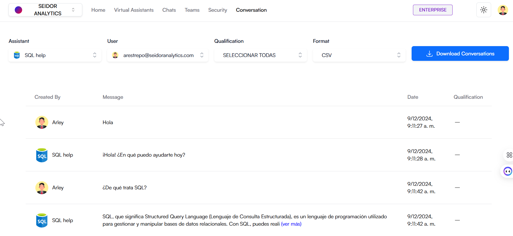

The Conversations screen in Daiana allows users to review and manage interactions made with virtual assistants. Here you can view the message history between a specific user and a virtual assistant, providing a detailed view of conversations and their context.

## **Screen Components**

**1) Top Navigation Bar:**

-   **Tenant:** Identification of the Tenant associated with the logged-in user.
-   **Navigation Menu:** Includes the Home, Virtual Assistants, Chats, Teams, Security, and Conversations sections.
-   **Plan Indicator:** Shows the user's current plan (e.g., Enterprise).
-   **Theme Icon:** Access to platform theme types (e.g., Dark).
-   **User Profile:** Access to profile settings and user options.

**2) Selections:**

-   **Selected Assistant:** Dropdown allowing selection of the virtual assistant whose conversation you wish to review.
-   **Selected User:** Dropdown allowing selection of the specific user whose interactions you wish to review.
-   **Selected Rating:** Dropdown allowing selection of the rating given to responses.
-   **Selected Format:** Dropdown allowing selection of the format to download conversations.

**3) Conversation History:**

**Columns:**

-   **Created By:** Indicates who sent the message, can be the virtual assistant or the user.
-   **Message:** Content of the sent message.
-   **Date:** Date and time the message was sent.
-   **Rating:** Option to rate the usefulness of the assistant's response (if enabled).

## **Procedures and Functionalities**

**1) Select a Virtual Assistant:**

-   Use the dropdown under “Selected Assistant” to choose the virtual assistant whose conversations you wish to review.

**2) Select a User:**

-   Use the dropdown under “Selected User” to choose the specific user whose interactions you wish to review.

**3) Select a Rating:**

-   Use the dropdown under “Selected Rating” to choose the rating whose conversations you wish to review.

**4) Select a Format:**

-   Use the dropdown under “Selected Format” to choose the format to download conversations.

**5) Review Conversation History:**

-   After selecting filters, the conversation history will be displayed in the table below.
-   You can scroll through the message list to view all interactions, including content, sender, and time.

**6) View More Information:**

-   To get more details about a specific message, click “view more” if available, to expand the message and view additional information.

**7) Rate Responses:**

-   If the rating function is enabled, you can rate the usefulness of the assistant's responses in the rating column.

**8) Download Conversations:**

-   Use the dropdown under “Selected Format” to choose the format to download conversations.
-   Click the button that says “Download Conversations” to download conversations in the previously selected format.