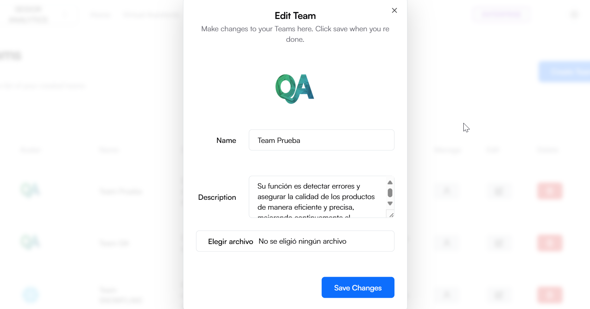
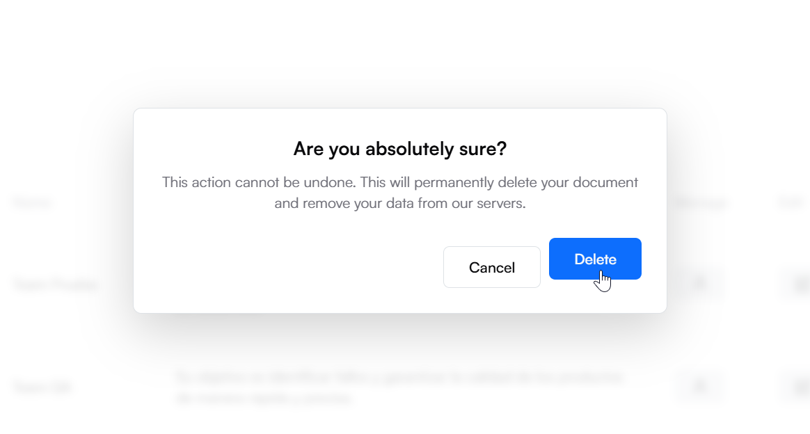

The Teams screen in Daiana allows users to view, manage, and create teams that group virtual assistants by specific areas or departments. This view offers a clear and organized list of all created teams, with options to manage, edit, or delete each team.

## **Screen Components**

**1) Top Navigation Bar:**

-   **Tenant:** Identification of the Tenant associated with the logged-in user.
-   **Navigation Menu:** Includes the Home, Virtual Assistants, Chats, Teams, Security, and Conversations sections.
-   **Plan Indicator:** Shows the user's current plan (e.g., Enterprise).
-   **Theme Icon:** Access to platform theme types (e.g., Dark).
-   **User Profile:** Access to profile settings and user options.

**2) Teams Header:**

-   **Title:** “Teams” indicates the current section of the platform.
-   **“Create Team” Button:** Blue button on the right allowing the creation of a new team.

**3) Teams List:**

**Columns:**

-   **Avatar:** Icon representing the team.
-   **Name:** Team name.
-   **Description:** Brief description of the team and its functions.
-   **Manage:** Person icon to manage team members.
-   **Edit:** Pencil icon to edit team information.
-   **Delete:** Trash icon to delete the team.

## **Procedures and Functionalities**

**1) Create a New Team:**

-   Click the “Create Team” button.
-   Complete the form with the team name, description, and other required details.
-   Click “Save” to create the team.

**2) Manage a Team:**

-   In the “Manage” column, click the person icon next to the team you wish to manage.
-   This action will take you to a view where you can add or remove team members and adjust their roles.

**3) Edit a Team:**

-   In the “Edit” column, click the pencil icon next to the team you wish to edit.
-   Modify the necessary information in the displayed form and click “Save” to update team details.

**4) Delete a Team:**

-   In the “Delete” column, click the trash icon next to the team you wish to delete.
-   Confirm the action in the confirmation dialog to permanently delete the team.

## **Procedure to create a new team**

A) Access the Teams Section

-   From the top navigation bar, select “Teams”.

B) Create a New Team:

-   Click the “Create Team” button.

C) Configure the Team

-   **Team Name:** Enter a unique name for the team in the corresponding field.
-   **Description**: Provide a brief description of the team's functions.
-   **Team Avatar**: Click “Select file” to upload an image representing the team (allowed formats: JPG, PNG, WEBP, SVG, max size 5 MB).

D) Create the Team:

-   Click the “Create Team” button to save the configuration and create the new Team.

## **Procedure to manage a team**

A) Access the Teams Section

-   From the top navigation bar, select “Teams”.

B) Manage a Team:

-   click the person icon next to the team you wish to manage.

C) Configure the Team:

**Search Bar:** enter terms to search for specific virtual assistants.

**Download Users:** Clicking the “Download Users” button will download the list of users in the team in XLSX format.

**View**: If the user role is user, the checkbox will be enabled; activating it adds the user to the team. If the user role is admin, the checkbox will be disabled.

## **Procedure to edit a team**

A) Access the Teams Section

-   From the top navigation bar, select “Teams”.

B) Edit a Team:

-   click the pencil icon next to the team you wish to manage.

C) Configure the Team:

-   **Team Name:** Enter a unique name for the team in the corresponding field.
-   **Description**: Provide a brief description of the team's functions.
-   **Team Avatar**: Click “Select file” to upload an image representing the team (allowed formats: JPG, PNG, WEBP, SVG, max size 5 MB).

D) Edit the Team:

-   Click the “Edit Team” button to save the configuration and edit the Team.

## **Procedure to delete a team**

A) Access the Teams Section

-   From the top navigation bar, select “Teams”.

B) Delete a Team:

-   click the trash icon next to the team you wish to delete.
-   To confirm, click the “Delete” button.