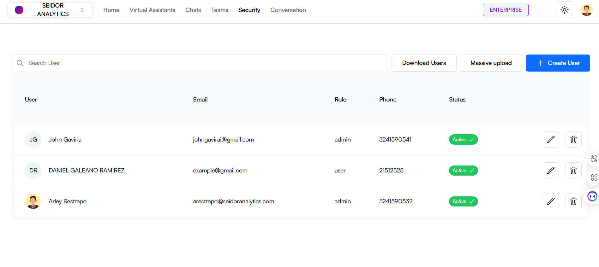
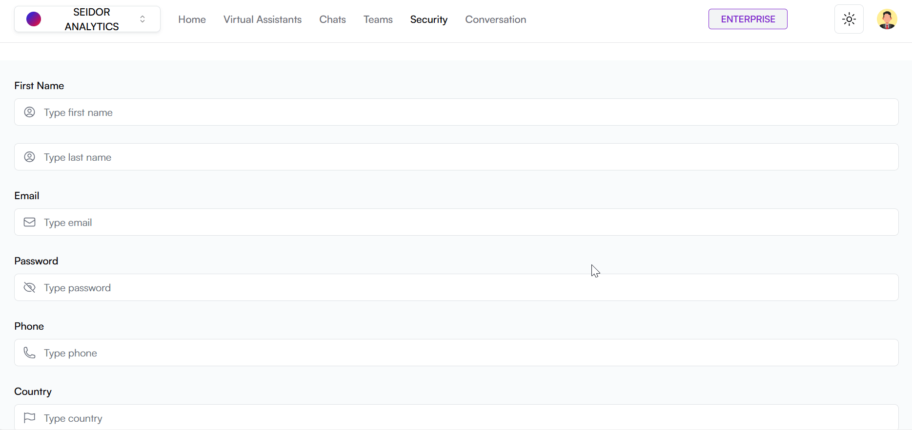

The Security screen in Daiana allows administrators to manage platform users, including creating, editing, and deleting user accounts. It also offers an overview of user roles and statuses.

## Screen Components

**1) Top Navigation Bar:**

-   **Tenant:** Identification of the Tenant associated with the logged-in user.
-   **Navigation Menu:** Includes the Home, Virtual Assistants, Chats, Teams, Security, and Conversations sections.
-   **Plan Indicator:** Shows the user's current plan (e.g., Enterprise).
-   **Theme Icon:** Access to platform theme types (e.g., Dark).
-   **User Profile:** Access to profile settings and user options.

**2) Security Header:**

-   **Title:** “Security” indicates the current section of the platform.
-   **“Download Users” Button:** White button on the right allowing the download of the user list in XLSX format.
-   **“Massive Upload” Button:** White button on the right allowing team member invitations.
-   **“Massive Upload” Button:** Blue button on the right allowing the addition of a new user.

**3) Search Bar:**

-   **Search Field:** Text box where administrators can enter terms to search for specific users.

**4) User List:**

**Columns:**

-   **User:** User name and profile image.
-   **Email:** User's email address.
-   **Role:** Role assigned to the user. Available roles in the application are:

1.  **Admin:** This role enables access to all functionalities.
2.  **Creator:** With this role, the user can only create virtual assistants. Cannot manage teams or users.
3.  **User:** The user can only chat with virtual assistants. Cannot manage teams, users, or virtual assistants.

-   **Phone:** User's contact phone number.
-   **Status:** User's current status (e.g., Active, Inactive).
-   **Edit:** Pencil icon to edit user information.
-   **Delete:** Trash icon to delete the user.

## Procedures and Functionalities

**1) Create a New User:**

-   Click the “Create User” button.
-   Complete the form with the required information, including name, email, role, phone, and status.
-   Click “Save” to add the new user.

**2) Search for a User:**

-   Enter the name, email, or other relevant information in the search field to locate specific users quickly.

**3) Edit a User:**

-   In the “Edit” column, click the pencil icon next to the user you wish to edit.
-   Modify the necessary information in the displayed form and click “Save” to update user details.

**4) Delete a User:**

-   In the “Delete” column, click the trash icon next to the user you wish to delete.
-   Confirm the action in the confirmation dialog to permanently delete the user.

**5) Download Users:**

-   Click the “Download Users” button.

**6) Invite team members:**

-   Click the “Massive Upload” button.
-   Invite new team members.
-   Click “Send Invitations” to invite new members.

## Procedure to create a new user

A) Access the Security Section

-   From the top navigation bar, select “Security”.

B) Create a New User:

-   Click the “Create User” button.

C) Configure the User

-   **User Name:** Enter the user's name in the corresponding field.
-   **User Surname:** Enter the user's surname in the corresponding field.
-   **User Email:** Enter the user's email in the corresponding field.
-   **User Password:** Enter the user's password in the corresponding field.
-   **User Phone:** Enter the user's phone in the corresponding field.
-   **User Country:** Enter the user's country in the corresponding field.
-   **User Role:** Select the role the user will have.

D) Create the User:

-   Click the “Create User” button to save the configuration and create the new User.

## Procedure to edit a user

A) Access the Security Section

-   From the top navigation bar, select “Security”.

B) Edit a User:

-   click the pencil icon next to the team you wish to manage.

C) Configure the User

-   **User Phone:** Enter the user's phone in the corresponding field.
-   **User Country:** Enter the user's country in the corresponding field.
-   **User Role:** Select the role the user will have.

D) Edit the User:

-   Click the “Edit User” button to save the configuration and edit the User.

## Procedure to delete a user

A) Access the Users Section

-   From the top navigation bar, select “Users”.

B) Delete a User:

-   click the trash icon next to the team you wish to delete.
-   To confirm, click the “Accept” button.

## Procedure to invite new team members

A) Access the Security Section

-   From the top navigation bar, select “Security”.

B) Invite new team members:

-   Click the “Massive Upload” button.

C) Configure the invitation

-   **Select team:** Select the team(s) the invited people will join by clicking the “Add” button.
-   **Mass invitation**: Enter the email addresses of the people you wish to invite. Separate entries by commas, semicolons, pipes, or spaces. Max 100 emails.

D) Send Invitations:

-   Click the “Send Invitations” button to save the configuration and send the invitations.