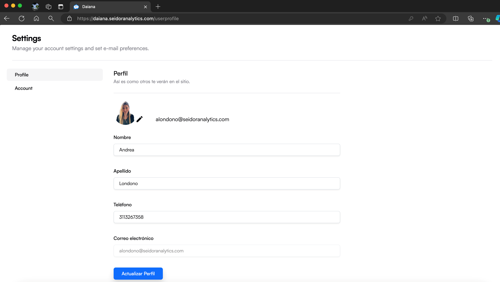

La pantalla de Configuración de Perfil en Daiana permite a los usuarios gestionar y actualizar su información personal y preferencias de cuenta. Esta interfaz facilita la modificación de datos como el nombre, apellido, teléfono y dirección de correo electrónico.

## Componentes de la Pantalla

**1) Barra de Navegación Superior:**

-   **Tenant:** Identificación del Tenant asociado al usuario logueado.
-   **Menú de Navegación:** Incluye las secciones de Inicio, Asistentes Virtuales, Chats, Equipos, Seguridad y Conversaciones.
-   **Perfil del Usuario:** Acceso a las configuraciones de perfil y opciones de usuario.
-   **Indicador de Plan:** Muestra el plan actual del usuario (por ejemplo, Enterprise).
-   **Icono de Configuración:** Acceso a las configuraciones avanzadas de la plataforma.

**2) Encabezado de Configuración:**

-   **Título:** "Settings" indica la sección actual de la plataforma.
-   **Subtítulo:** "Manage your account settings and set e-mail preferences" proporciona una breve descripción de la función de esta sección.

**3) Menú Lateral de Configuración:**

-   **Profile:** Opción seleccionada para gestionar la información del perfil.
-   **Account:** Opción para gestionar las configuraciones de la cuenta. 

**4) Sección de Perfil:**

-   **Avatar:** Imagen de perfil del usuario con la opción de cambiarla mediante el icono de lápiz.
-   **Correo Electrónico:** Dirección de correo electrónico del usuario, no editable.
-   **Campos de Información Personal:**
-   **Nombre:** Campo para ingresar o actualizar el nombre del usuario.
-   **Apellido:** Campo para ingresar o actualizar el apellido del usuario.
-   **Teléfono:** Campo para ingresar o actualizar el número de teléfono del usuario.
-   **Correo Electrónico:** Campo que muestra la dirección de correo electrónico actual del usuario (no editable).

**5) Botón de Actualización:**

-   **Actualizar Perfil:** Botón azul que guarda los cambios realizados en la información del perfil.

## Procedimientos y Funcionalidades

**1) Actualizar el Nombre:**

-   Ingrese el nombre en el campo correspondiente bajo “Nombre”.

**2) Actualizar el Apellido:**

-   Ingrese el apellido en el campo correspondiente bajo “Apellido”.

**3) Actualizar el Teléfono:**

-   Ingrese el número de teléfono en el campo correspondiente bajo “Teléfono”.

**4) Guardar Cambios:**

-   Después de realizar las modificaciones necesarias, haga clic en el botón “Actualizar Perfil” para guardar los cambios. Una notificación de confirmación aparecerá si la actualización es exitosa.

**5) Cambiar la Imagen de Perfil:**

-   Haga clic en el icono de lápiz sobre la imagen de perfil para subir una nueva imagen desde su dispositivo.