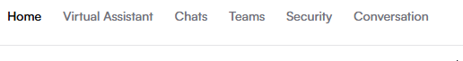
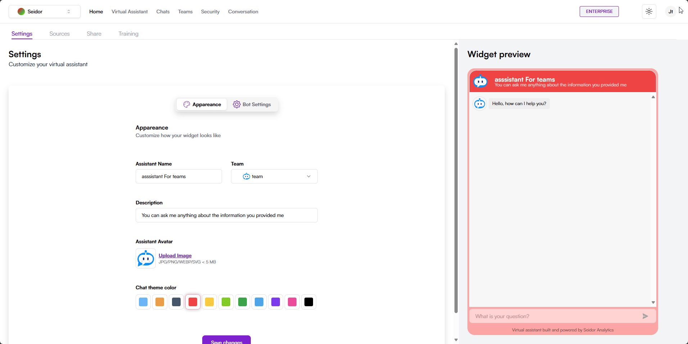
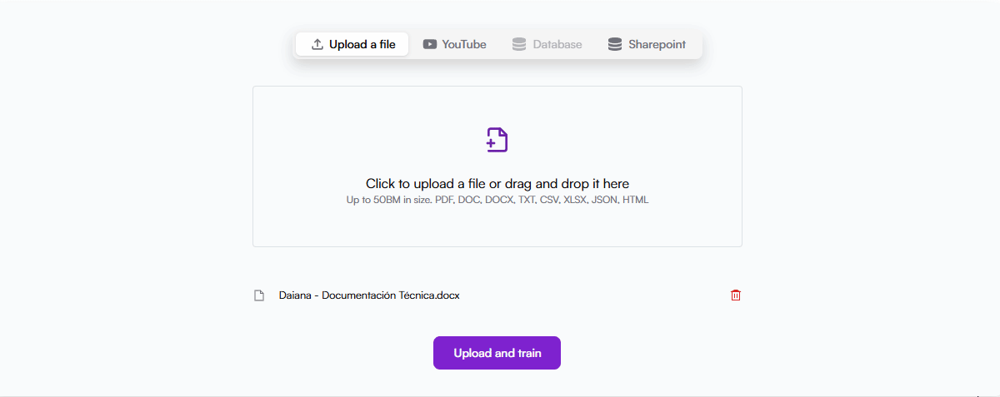
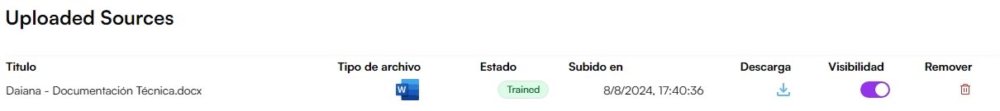

Let's start by configuring all the necessary elements for your first assistant

## Create a team

For this step, we will start by creating and configuring a team that will be in charge of managing the information provided by the virtual assistant. This is essential, since only team members will have access to the information returned by the assistant, thus ensuring security and proper handling of data.

## Generate your first virtual assistant

Once the team is created, we can generate our first virtual assistant, which will be available exclusively to team members. (For information about team members, consult this link).

For this we will go to the [Virtual Assistant](https://daianadmo.seidoranalytics.com/virtual-assistants) section in the navigation bar.
 

Once in this section we will generate our virtual assistant with the **“New virtual assistant”** button located in the upper right part of the section.

Now we will configure the fundamental elements of our assistant, including the name and the team that will have access to the virtual assistant, as well as the type of connection it will use, whether through data from a database or text documents and/or videos. We will also adjust aesthetic details such as the chat color, avatar, and description.

### Let's feed the virtual assistant

Daiana's virtual assistants are only fed by the information we upload to our virtual assistants. Not only to keep your data safe, but also to provide only the necessary answers for your company.
In this example we will upload documents for this assistant's learning, but if it requires configuring for a database, please consult the following link.

  
Once the file is selected, we will train our assistant with this information.

You can verify, deactivate, and delete all documents uploaded to the robot in the final section of this page.

