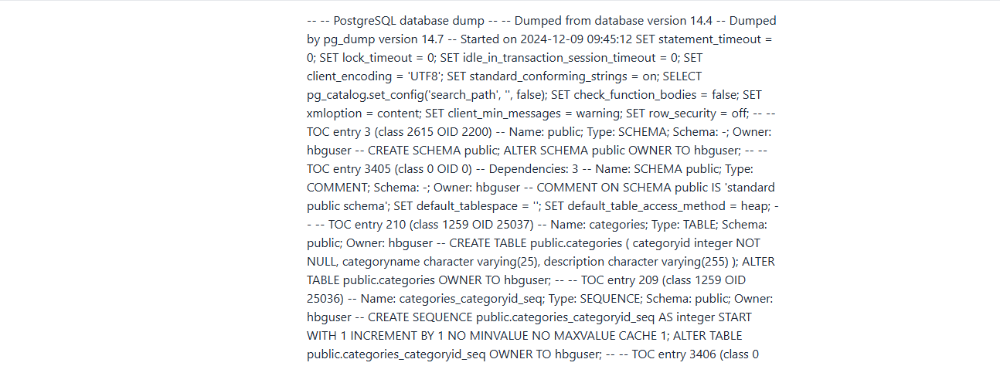

# ¿Qué es la consola de entrenamiento ?
La consola de entrenamiento es una herramienta avanzada diseñada para que los usuarios carguen información estructurada.

Esta información es utilizada por el modelo para generar respuestas precisas, gráficos detallados y consultas SQL lógicas.

Mediante el uso de esta consola, el modelo se entrena para comprender mejor las preguntas formuladas y responder de manera efectiva, utilizando los datos y las reglas proporcionadas.

#### Tipos de Entrenamiento Disponibles
En la consola de entrenamiento de La consola de entrenamiento, puedes cargar información en tres categorías principales:

- **DDL**
- **Documentacio**
- **SQL**


A continuación, se explica cada una

# DDL (Data Definition Language)
**Qué es:**
- Representa la estructura y definición de las bases de datos. Incluye tablas, columnas, tipos de datos, relaciones y restricciones.
- Permite que la consola de entrenamiento entienda cómo están organizados los datos y qué información puede extraer.

**Ejemplo de DDL:**

```
CREATE TABLE employees (
	id SERIAL PRIMARY KEY,
  name VARCHAR(100),
  ales DECIMAL(10, 2),
  department_id INT,
  hire_date DATE  
);
```

**Cómo se usa**
 - Utiliza esta información para validar las consultas y asegurarse de que las preguntas se respondan con los datos reales disponibles.
- Ayuda a generar consultas SQL precisas basadas en la estructura de la base de datos.


# Documentación
**Qué es:**

- Es el conjunto de reglas, ejemplos y descripciones que se cargan para guiar su comportamiento en situaciones específicas.
- Incluye explicaciones sobre cómo generar gráficos, cómo interpretar las preguntas y qué enfoque debe tomar al responder.


**Ejemplo de Documentación:**
Para preguntas relacionadas con ventas totales por empleado:
- Usa un gráfico de barras para comparar empleados.
- El eje X debe mostrar los nombres de los empleados.
- El eje Y debe mostrar las ventas totales.
- Si se especifica un periodo de tiempo, filtra los datos por año o mes.

**Cómo se usa**
- Define las reglas de negocio y el comportamiento esperado para casos específicos.
- Es útil para resolver ambigüedades en las preguntas y priorizar ciertos enfoques o tipos de gráficos


# SQL

**Qué es:**
- Representa consultas SQL específicas que se utilizan para extraer datos directamente desde la base de datos.
- Sirve como una biblioteca de ejemplos de cómo deben estructurarse las consultas para diferentes tipos de preguntas.

**Ejemplo de SQL:**

```
	SELECT name,SUM(sales) as Total_sale
  FROM employees
  WHERE hire_date>= '2023-01-01'
  GROUP BY name
  ORDER BY total_sales_DESC
```


** Cómo se usa**
- Genera consultas dinámicamente basándose en las preguntas del usuario y utiliza las consultas SQL entrenadas como plantillas.
- Asegura que las consultas sean precisas y relevantes para el caso de uso.


# ¿Cómo se usa el Entrenamiento?
- La consola de entrenamiento utiliza los elementos cargados de manera complementaria:

**DDL:**
- Es la base de conocimiento estructural. Sin esta información no puede entender cómo están organizados los datos.

**Documentación**
- Guía el enfoque lógico y visual de las respuestas (gráficos, tablas, etc.).
- Es particularmente útil para resolver ambigüedades o preferencias de visualización.

**SQL**
- Proporciona ejemplos prácticos y predefinidos para ayudar a generar consultas rápidas y eficientes

# ¿Tiene el Entrenamiento Alguna Prioridad? 

#### No hay prioridad basada en el orden de carga:
- no se asigna mayor peso al primer entrenamiento que se carga en comparación con el segundo o tercero. Todos los elementos cargados son considerados igualmente relevantes.

#### Prioridad basada en la consulta:
- Si una consulta requiere interpretar datos, DDL tiene mayor relevancia.
- Si una consulta es ambigua o requiere un gráfico específico, Documentacion tendrá mayor influencia.
- Si la pregunta se puede responder con un ejemplo de consulta predefinido, SQL será priorizado.


#### Conflictos entre elementos de entrenamiento:
Si hay reglas contradictorias (Ej. Documentacion dice usar un gráfico de torta, pero otro documento indica usar barras), La consola tratará de resolver la ambigüedad basándose en las palabras clave de la consulta.


# Recomendaciones para Cargar Entrenamientos

**Estructura clara**
Asegúrate de que cada tipo de entrenamiento esté bien definido y no haya información redundante o contradictoria.

**Usa ejemplos específicos:**
Proporciona ejemplos en Documentacion y SQL para casos comunes que anticipes en tu sistema

**Actualización periódica:**
Revisa y actualiza los entrenamientos para reflejar cambios en los datos o nuevos requerimientos

**Depuración**
Después de cargar nuevos elementos, realiza pruebas con preguntas relacionadas para validar que La consola de entrenamiento esté respondiendo correctamente.


# Conclusión

La consola de entrenamiento es una herramienta que, al ser utilizada correctamente, puede maximizar la precisión y relevancia de las respuestas y gráficos generados.

Al comprender cómo se usan los diferentes tipos de entrenamiento (DDL, Documentacion y SQL) y cómo La consola de entrenamiento prioriza la información, puedes garantizar un sistema más eficiente y enfocado en los requerimientos de usuario.


# ¿Cómo cargar entrenamiento desde Daiana?
Desde las configuraciones de nuestro asistente debemos dirigirnos al apartado de entrenamiento


En este apartado debemos tener todas las credenciales de nuestra “Consola de entrenamiento” cargadas para poder dirigirnos al apartado de “Entrenamiento”. Estas credenciales se consiguen a través del equipo de PI.


En nuestra esquina superior izquierda veremos el logo de Seidor y hacemos
click en “Entrenamiento.


Para añadir entrenamiento hacemos click en el botón azul


Teniendo en cuenta nuestras necesidades de entrenar a nuestro asistente y teniendo en cuenta el tipo de entrenamiento que debemos agregar seleccionamos “tipo de entrenamiento”


Una vez agreguemos en el input el entrenamiento deseado damos guardar y nuestro asistente ya estará teniendo en cuenta el entrenamiento agregado.

# ¿Cómo reemplazar un entrenamiento agregado?
Actualmente no podemos editar el entrenamiento agregado, por ende debemos buscar el entrenamiento previo agregado y eliminarlo. con el botón de Eliminar y volviendo a cargar el entrenamiento actualizado.


# Recomendaciones  
Recomendaciones para optimizar las respuestas de un asistente de base de datos

## Cargar como tipo DDL la estructura de la base de datos:
- Asegúrate de cargar la estructura de la base de datos como DDL. Esto ayuda a que el asistente comprenda cómo está organizada la información, incluyendo tablas, columnas, relaciones y tipos de datos.
- De esta forma, La consola de entrenamiento podrá identificar con precisión los valores necesarios para responder consultas, evitando errores relacionados con datos inexistentes o mal interpretados.


## Documentar preguntas frecuentes como tipo “Documentacion”:

- Para preguntas comunes, carga reglas claras en la sección Documentacion. Define no solo el tipo de respuesta esperada, sino también la dirección o columna específica de donde se debe obtener el valor.
- Por ejemplo, si una consulta frecuente es “¿Cuáles son las ventas totales por empleado?”, puedes incluir en la documentación la regla que indique que las ventas deben ser calculadas a partir de la columna “sales” agrupada por “employee_name”.


## Problemas por Falta de Entrenamiento
Estas son las causas comunes de problemas por falta de entrenamiento

### Datos insuficientes o mal estructurados en la base de datos (DDL)
**Causa**
- Si la estructura de la base de datos cargada (DDL) no está completa o contiene errores, La consola de entrenamiento no podrá interpretar correctamente las consultas ni generar respuestas lógicas.

**Manifestaciones**
- No encuentra columnas o tablas solicitadas en las preguntas.
- Las consultas SQL generadas son incorrectas porque no tienen en cuenta las relaciones o tipos de datos.
- Gráficos vacíos o basados en datos inexistentes.

**Ejemplo**
- Si una tabla de empleados no incluye un campo para “ventas totales”, La consola de entrenamiento no podrá responder a preguntas sobre “¿Cuánto vendió cada empleado?”.

### Reglas poco específicas o ambiguas en el entrenamiento de Documentación
**Causa**
- Las instrucciones en Documentación no están claramente definidas o no cubren suficientes casos de uso, lo que genera respuestas inconsistentes o sin sentido.

**Manifestaciones**

- La consola de entrenamiento elige un tipo de gráfico incorrecto (e.g., genera un gráfico de barras en lugar de un gráfico de torta solicitado).
- Respuestas ambiguas o incompletas porque no hay suficientes guías para interpretar preguntas complejas.
- Gráficos con etiquetas y valores desordenados

**Ejemplo**
- Si no se especifica que los gráficos de torta deben mostrar proporciones,la consola de entrenamiento podría usar otro tipo de gráfico que no refleje bien los datos.


### Consultas SQL incompletas o mal diseñadas en el entrenamiento
**Causa**
- Las consultas SQL cargadas en el entrenamiento no son representativas o están mal diseñadas, lo que afecta la capacidad para generar respuestas basadas en datos.

**Manifestaciones**
- Respuestas incorrectas o irrelevantes para las preguntas del usuario.
- Se genera consultas SQL que devuelven resultados vacíos o incorrectos.
- Gráficos que no corresponden a los datos esperados.

**Ejemplo**
- Si la consulta SQL para ventas no filtra por fechas correctamente, las respuestas incluirán datos irrelevantes o desactualizados.

### Falta de cobertura en casos de uso frecuentes
**Causa**
- El entrenamiento no incluye ejemplos de preguntas y respuestas relevantes para los casos de uso más comunes de la aplicación.


**Manifestaciones**
- No responde o devuelve mensajes genéricos como “No sé cómo responder esta pregunta.”
- Respuestas que no tienen sentido porque no están basadas en reglas o ejemplos claros.
- El modelo no genera gráficos adecuados para preguntas complejas o específicas.

**Ejemplo**
- Si no se entrena La consola de entrenamiento para responder preguntas como “¿Cuáles son las ventas totales por región en 2023?”, La consola de entrenamiento podría fallar al interpretar esta consulta.

### Conclusión
**Para evitar estos problemas, es fundamental:**
1. Completar el entrenamiento DDL con una estructura detallada y correcta de la base de datos.
2. Definir reglas claras en Documentacion que aborden casos específicos y enfoques gráficos.
3. Diseñar consultas SQL representativas y probarlas con datos reales.
4. Ampliar el entrenamiento para incluir ejemplos de preguntas frecuentes y casos de uso clave.
