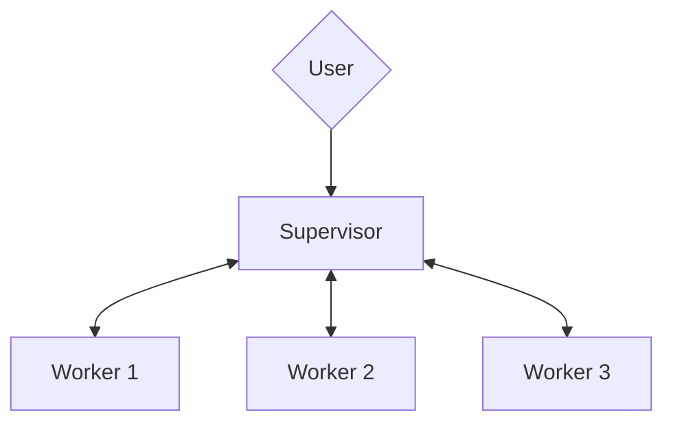

# Multi-Agents

This guide aims to provide an introduction to the multi-agent AI system architecture within Daiana Studio, detailing its components, operational constraints, and workflow.

## Concept

Analogous to a team of domain experts collaborating on a complex project, a multi-agent system uses the principle of specialization within artificial intelligence.

This multi-agent system uses a hierarchical and sequential workflow, maximizing efficiency and specialization.

### 1. System Architecture

We can define multi-agent AI architecture as a scalable AI system capable of handling complex projects by breaking them down into manageable sub-tasks.

In Daiana Studio, a multi-agent system comprises two main nodes or agent types and a user, interacting in a hierarchical graph to process requests and deliver a specific outcome:

1.  **User:** The user acts as the **system's starting point**, providing the initial input or request. While a multi-agent system can be designed to handle a wide range of requests, it is important that these user requests align with the system's intended purpose. Any request that falls outside this scope may lead to inaccurate results, unexpected loops, or even system errors. Therefore, user interactions, although flexible, should always align with the system's core functionalities for optimal performance.
2.  **Supervisor AI:** The Supervisor acts as the **system orchestrator**, overseeing the entire workflow. It analyzes user requests, breaks them down into a sequence of sub-tasks, assigns these sub-tasks to specialized worker agents, aggregates the results, and finally presents the processed output back to the user.
3.  **Worker AI Team:** This team consists of specialized AI agents, or Workers, each instructed - through prompt messages - to handle a specific task within the workflow. These Workers operate independently, receiving instructions and data from the Supervisor, **executing their specialized functions**, using tools as needed, and returning the results to the Supervisor.

### 2. Operational Constraints

To maintain order and simplicity, this multi-agent system operates under two important constraints:

*   **One task at a time:** The Supervisor is intentionally designed to focus on a single task at a time. It waits for the active Worker to complete its task and return the results before analyzing the next step and delegating the subsequent task. This ensures that each step is successfully completed before proceeding, preventing over-complexity.
*   **One Supervisor per flow:** While it is theoretically possible to implement a set of nested multi-agent systems to form a more sophisticated hierarchical structure for highly complex workflows, what LangChain defines as **Hierarchical Agent Teams**, with a top-level supervisor and mid-level supervisors managing worker teams, Daiana Studio's multi-agent systems currently operate with a single Supervisor.

:::info
These two constraints are important when **planning your application's workflow**. If you try to design a workflow where the Supervisor needs to delegate multiple tasks simultaneously, in parallel, the system will not be able to handle it and you will encounter an error.
:::

***

## The Supervisor

The Supervisor, as the agent governing the overall workflow and responsible for delegating tasks to the appropriate Worker, requires a set of components to function correctly:

*   **Chat Model capable of function calling** to handle the complexities of task decomposition, delegation, and results aggregation.
*   **Agent Memory (optional)**: While the Supervisor can function without Agent Memory, this node can significantly enhance workflows that require access to past Supervisor states. This **state preservation** could allow the Supervisor to resume work from a specific point or leverage past data to improve decision-making.

### Supervisor Prompt

By default, the Supervisor Prompt is worded in a way that instructs the Supervisor to analyze user requests, break them down into a sequence of sub-tasks, and assign these sub-tasks to specialized worker agents.

While the Supervisor Prompt is customizable to suit specific application needs, it always requires the following two key elements:

*   **The `{team_members}` Variable:** This variable is crucial for the Supervisor's understanding of the available workforce as it provides the Supervisor with a list of Worker names. This allows the Supervisor to diligently delegate tasks to the most appropriate Worker based on their expertise.
*   **The "FINISH" Keyword:** This keyword serves as a signal within the Supervisor Prompt. It indicates when the Supervisor should consider the task complete and present the final output to the user. Without a clear "FINISH" directive, the Supervisor might continue to delegate tasks unnecessarily or fail to deliver a coherent and finalized result to the user. It signals that all necessary sub-tasks have been executed and the user's request has been fulfilled.

:::info
It is important to understand that the Supervisor plays a very distinct role from the Workers. Unlike Workers, which can be tailored with highly specific instructions, the **Supervisor operates more effectively with general directives, allowing it to plan and delegate tasks as it deems appropriate.** If you are new to multi-agent systems, we recommend sticking to the default Supervisor prompt.
:::

### Understanding the Recursion Limit in the Supervisor node:

This parameter restricts the maximum depth of nested function calls within our application. In our current context, it **limits how many times the Supervisor can activate itself within a single workflow execution**. This is important to prevent unbounded recursion and ensure that resources are used efficiently.

### How the Supervisor works

Upon receiving a user query, the Supervisor initiates the workflow by analyzing the request and discerning the user's intended outcome.

Then, leveraging the `{team_members}` variable in the Supervisor Prompt, which only provides a list of available Worker AI names, the Supervisor infers each Worker's specialty and strategically selects the most suitable Worker for each task within the workflow.

:::info
Since the Supervisor only has the Workers' names to infer their functionality within the workflow, it is very important that these names are set appropriately. **Clear, concise, and descriptive names that accurately reflect the Worker's role or area of expertise are crucial for the Supervisor to make informed decisions when delegating tasks.** This ensures that the correct Worker is selected for the correct job, maximizing the system's accuracy in fulfilling the user's request.
:::

---

## **The Worker**

The Worker, as a specialized agent instructed to handle a specific task within the system, requires two essential components to function correctly:

*   **A Supervisor:** Each Worker must be connected to the Supervisor so that it can be called when a task needs to be delegated. This connection establishes the essential hierarchical relationship within the multi-agent system, ensuring that the Supervisor can efficiently distribute work to the appropriate specialized Workers.
*   **A Chat Model node capable of function calling**: By default, Workers inherit the Supervisor's Chat Model node unless one is directly assigned to them. This function-calling capability allows the Worker to interact with tools designed for its specialized task.

:::info
The ability to assign **different Chat Models to each Worker** provides significant flexibility and optimization opportunities for our application. By selecting **Chat Models** tailored to specific tasks, we can leverage more cost-effective solutions for simpler tasks and reserve specialized, potentially more expensive models, when truly necessary.
:::

### Understanding the Max Iteration parameter in Workers

**LangChain** refers to `Max Iterations Cap` as an important control mechanism to prevent runaway behavior within an agentic system. In our current context, it serves as a safeguard against excessive, potentially infinite, interactions between the Supervisor and the Worker.

Unlike the Supervisor node's `Recursion Limit`, which restricts how many times the Supervisor can call itself, the Worker node's `Max Iteration` parameter limits how many times a Supervisor can iterate or query a specific Worker.

By limiting Max Iteration, we ensure that costs remain under control, even in cases of unexpected system behavior.

***

## Example: A practical use case

Now that we have established a fundamental understanding of how Multi-Agent systems work within Daiana Studio, let's explore a practical application.

Imagine a **Lead Outreach multi-agent system** (available in the Marketplace) designed to automate the process of identifying, qualifying, and engaging with potential leads. This system would use a Supervisor to orchestrate the following two Workers:

*   **Lead Researcher:** This Worker, using the Google Search Tool, will be responsible for gathering potential leads based on criteria defined by the user.
*   **Lead Sales Generator:** This Worker will use the information gathered by the Lead Researcher to create personalized email drafts for the sales team.

**Background:** A user working at Solterra Renewables wants to gather available information about Evergreen Energy Group, a reputable renewable energy company located in the UK, and target its CEO, Amelia Croft, as a potential lead.

**User Request:** The Solterra Renewables employee provides the following query to the multi-agent system: "_I need information about Evergreen Energy Group and Amelia Croft as a potential new client for our business._"

1.  **Supervisor:**
    *   The Supervisor receives the user's request and delegates the "Lead Research" task to the `Lead Researcher Worker`.
2.  **Lead Researcher Worker:**
    *   The Lead Researcher Worker, using the Google Search Tool, gathers information about Evergreen Energy Group, focusing on:
        *   Company background, industry, size, and location.
        *   Recent news and developments.
        *   Key executives, including confirmation of Amelia Croft's role as CEO.
    *   The Lead Researcher sends the gathered information back to the `Supervisor`.
3.  **Supervisor:**
    *   The Supervisor receives the research data from the Lead Researcher Worker and confirms that Amelia Croft is a relevant lead.
    *   The Supervisor delegates the "Generate Sales Email" task to the `Lead Sales Generator Worker`, providing:
        *   The research information about Evergreen Energy Group.
        *   Amelia Croft's email.
        *   Context about Solterra Renewables.
4.  **Lead Sales Generator Worker:**
    *   The Lead Sales Generator Worker drafts a personalized email tailored to Amelia Croft, taking into account:
        *   Her role as CEO and the relevance of Solterra Renewables' services to her company.
        *   Information from the research about Evergreen Energy Group's focus or current projects.
    *   The Lead Sales Generator Worker sends the completed email draft back to the `Supervisor`.
5.  **Supervisor:**
    *   The Supervisor receives the generated email draft and issues the "FINISH" directive.
    *   The Supervisor sends the email draft back to the user, the `Solterra Renewables employee`.
6.  **User Receives Output:** The Solterra Renewables employee receives a personalized email draft ready to be reviewed and sent to Amelia Croft.
