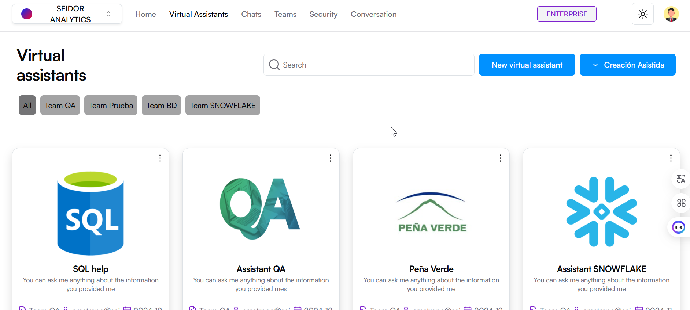
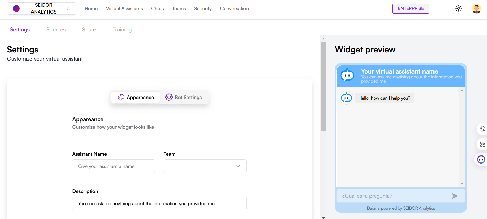

  
La pantalla de Asistentes Virtuales en Seidor Analytics permite a los usuarios ver, buscar y gestionar los asistentes virtuales disponibles en la plataforma. Esta pantalla ofrece una vista de tarjetas de los asistentes virtuales, cada una proporcionando información clave y accesos directos a funcionalidades específicas.

**Componentes de la Pantalla**

**1) Barra de Navegación Superior:**

-   **Tenant:** Identificación del Tenant asociado al usuario logueado.
-   **Menú de Navegación:** Incluye las secciones de Inicio, Asistentes Virtuales, Chats, Equipos, Seguridad y Conversaciones.
-   **Indicador de Plan:** Muestra el plan actual del usuario (por ejemplo, Enterprise).
-   **Icono de Tema:** Acceso a los tipos de temas de la plataforma (por ejemplo, Dark).
-   **Perfil del Usuario:** Acceso a las configuraciones de perfil y opciones de usuario.

**2) Encabezado de Asistentes Virtuales:**

-   **Título:** “Asistentes virtuales” que indica la sección actual de la plataforma.
-   **Botón “Nuevo asistente virtual”:** Permite la creación de un nuevo asistente virtual.
-   **Botón “Creación Asistida”:** Con una guía rápida, permite la creación de un nuevo asistente virtual de Base de Datos o de SAP.

**3) Barra de Búsqueda y Filtros:**

-   **Campo de Búsqueda:** Caja de texto donde los usuarios pueden ingresar términos para buscar asistentes virtuales específicos.
-   **Filtros por Categoría:** Botones de filtro que permiten al usuario clasificar los asistentes virtuales por diferentes categorías (por ejemplo, Recursos Humanos, Comercial, Marketing, etc.).

**4) Tarjetas de Asistentes Virtuales:**

cada asistente virtual está representado por una tarjeta que incluye la siguiente información:

-   **Nombre del Asistente:** Título en la parte superior de la tarjeta.
-   **Descripción Breve:** Texto que indica la funcionalidad principal del asistente.
-   **Categoría:** Etiqueta que indica el área de aplicación del asistente (e.g., Comercial, Marketing, etc.).
-   **Equipo**: Nombre del equipo al que pertenece el asistente virtual.
-   **Contacto:** Dirección de correo electrónico del responsable del asistente.
-   **Fecha de Creación:** Fecha en que el asistente fue creado.
-   **Iconos de Funcionalidad:** Accesos rápidos para editar o gestionar el asistente.

## **Procedimientos y Funcionalidades**

**1) Crear un Nuevo Asistente Virtual:**

-   Haga clic en el botón “Nuevo asistente virtual”.
-   Complete el formulario con la información requerida y guarde para crear el nuevo asistente.

**2) Creación asistida de un Nuevo Asistente Virtual:**

-   Haga clic en el botón “Creación Asistida”.
-   Seleccione "Asistente SAP" o "Asistente BD".
-   Complete la guía rápida y guarde para crear el nuevo asistente.

**3) Buscar un Asistente Virtual:**

-   Ingrese palabras clave en el campo de búsqueda para localizar asistentes específicos.
-   Use los filtros por categoría para refinar los resultados de búsqueda.

**4) Editar un Asistente Virtual:**

-   Utilice el icono de configuración en la tarjeta del asistente y seleccione “Editar Asistente” para modificar la información o configuración del asistente virtual.

**5) Eliminar un Asistente Virtual:**

-   Utilice el icono de configuración en la tarjeta del asistente y seleccione “Eliminar Asistente” para eliminar el asistente virtual.

**6) Gestionar Asistentes por Categoría**

-   Haga clic en uno de los filtros por categoría para ver todos los asistentes virtuales en esa categoría específica.

## **Procedimiento para crear un Asistente Virtual, subir documentos y chatear**

### **1) Crear un Asistente Virtual**

A) Acceder a la Sección de Asistentes Virtuales

-   Desde la barra de navegación superior, seleccione “Asistentes Virtuales”.

B) Crear un Nuevo Asistente:

-   Haga clic en el botón “Nuevo asistente virtual”.

C) Configurar el Asistente:

-   **Nombre del Asistente:** Ingrese un nombre único para el asistente en el campo correspondiente.
-   **Equipo**: Seleccione el equipo al que pertenecerá el asistente desde el dropdown.
-   **Descripción**: Proporcione una breve descripción de las funciones y capacidades del asistente.
-   **Tipo de Conexión**: Seleccione la base de conocimientos que utilizará el asistente desde el dropdown.
-   **Proveedor de LLM**: Seleccione el proveedor que utilizará el asistente.
-   **Avatar del Asistente**: Haga clic en “Subir Imagen” para cargar una imagen que representará al asistente (formatos permitidos: JPG, PNG, WEBP, SVG, tamaño máximo de 5 MB).
-   **Color del Tema del Chat**: Seleccione un color para el tema del chat del asistente.

D) Crear el Asistente:

-   Revise la vista previa del chat en el panel derecho para asegurarse de que la configuración es la deseada.
-   Haga clic en el botón “Crear Asistente” para guardar la configuración y crear el nuevo asistente virtual.

### **2) Conectar el Asistente Virtual a una Base de Datos.**

A) Acceder a la Sección de Fuentes

-   En la pantalla de configuración del asistente, navegue a la pestaña “Fuentes”.

B) Seleccionar Tipo de Conexión:

-   Seleccione la opción “Base de Datos” en las fuentes de información.

C) Configurar la Conexión a la Base de Datos:

-   **Tipo de Base de Datos**: Seleccione el tipo de base de datos desde el dropdown. Bases de datos soportadas: PostgreSQL, Snowflake, MySQL, SQL Server, Amazon Redshift, SAP Hana.
-   **Host**: Ingrese el host de su base de datos.
-   **Esquema**: Ingrese el esquema de su base de datos.
-   **Usuario**: Ingrese el usuario de su base de datos.
-   **Puerto**: Ingrese el puerto de su base de datos.
-   **Nombre**: Ingrese el nombre de usuario para conectarse a la base de datos.
-   **Contraseña**: Ingrese la contraseña asociada al usuario de la base de datos.

D) Conectar y Entrenar:

-   Después de ingresar los detalles de la conexión, haga clic en el botón "Connect and train" para que el asistente se conecte a la base de datos y se entrene con la información proporcionada. Cabe aclarar que este paso corresponde a un proceso de entrenamiento básico. Para lograr un entrenamiento más avanzado se recomienda un acompañamiento de una asesoría técnica más específica.

### **3) Subir Documentos al Asistente Virtual**

A) Acceder a la Sección de Fuentes:

-   En la pantalla de configuración del asistente, navegue a la pestaña “Fuentes”.

B) Cargar un Nuevo Documento:

-   Seleccione el tipo de fuente que desea cargar (Por ejemplo, Archivo).
-   Arrastre y suelte el archivo en el área designada o haga clic en el área para seleccionar un archivo desde su dispositivo (hasta 50 MB, formatos permitidos: PDF, DOC, DOCX, TXT, CSV, XLSX, JSON, HTML).
-   Haga clic en el botón “Cargar y entrenar” para iniciar el proceso de carga y entrenamiento del asistente con las nuevas fuentes.

C) Gestionar Fuentes Cargadas:

-   Revise la lista de fuentes cargadas en la tabla.
-   Utilice los iconos de descarga para descargar archivos, los interruptores de visibilidad para controlar el acceso del asistente a los archivos y los iconos de papelera para eliminar archivos no deseados.

### **4) Chatear con el Asistente Virtual**

A) Acceder a la Sección de Chats:

-   Desde la barra de navegación superior, seleccione “Chats”.

B) Seleccionar el Equipo y el Asistente:

-   Utilice el panel de la izquierda para seleccionar el Equipo al cual pertenece el asistente.
-   Utilice el panel de la izquierda para elegir el asistente virtual con el que desea chatear.

C) Iniciar una Conversación

-   En la ventana de conversación, escriba su mensaje en el campo de entrada de mensajes en la parte inferior.
-   Presione la tecla Enter o haga clic en el icono de enviar para enviar su mensaje al asistente virtual.
-   Las respuestas del asistente virtual aparecerán en la ventana de conversación. Puede ver el historial de interacciones en esta área para referencia.

# Nuevo Asistente Virtual

  
La pantalla de Creación de Asistente Virtual en Daiana permite a los usuarios configurar y personalizar nuevos asistentes virtuales que pueden interactuar con los usuarios finales. Esta pantalla incluye opciones para personalizar la apariencia y comportamiento del asistente, así como la conexión a una base de conocimientos.

### **Componentes de la Pantalla**

**1) Barra de Navegación Superior:**

-   **Tenant:** Identificación del Tenant asociado al usuario logueado.
-   **Menú de Navegación:** Incluye las secciones de Inicio, Asistentes Virtuales, Chats, Equipos, Seguridad y Conversaciones.
-   **Indicador de Plan:** Muestra el plan actual del usuario (por ejemplo, Enterprise).
-   **Icono de Tema:** Acceso a los tipos de temas de la plataforma (por ejemplo, Dark).
-   **Perfil del Usuario:** Acceso a las configuraciones de perfil y opciones de usuario.

**2) Sección de Configuración de Asistente:**

-   **Nombre del Asistente:** Campo para asignar un nombre único al asistente virtual.
-   **Equipo:** Dropdown para seleccionar el equipo al que pertenecerá el asistente.
-   **Descripción:** Campo para proporcionar una breve descripción de las funciones del asistente.
-   **Tipo de Conexión:** Dropdown para seleccionar la base de conocimientos que utilizará el asistente.
-   **Proveedor de LLM**: Dropdown para seleccionar el proveedor que utilizará el asistente.
-   **Avatar del Asistente:** Opción para subir una imagen personalizada que representará al asistente (formatos permitidos: JPG, PNG, WEBP, SVG, tamaño máximo de 5 MB).
-   **Color del Tema del Chat**: Botones para seleccionat el color para el tema del chat del asistente.

**3) Vista del Chat:**

-   **Vista Previa:** Panel a la derecha que muestra una vista previa en tiempo real de cómo se verá el asistente virtual y el chat.

**4) Botón de Creación:**

-   **Crear Asistente:** Botón morado que guarda la configuración y crea el nuevo asistente virtual.

### **Procedimientos y Funcionalidades**

**1) Asignar un Nombre al Asistente:**

-   Ingrese un nombre único en el campo "Nombre del Asistente".

**2) Seleccionar un Equipo:**

-   Utilice el dropdown "Equipo" para seleccionar el equipo al que pertenecerá el asistente.

**3) Proporcionar una Descripción:**

-   Escriba una breve descripción de las funciones y capacidades del asistente en el campo "Descripción".

**4) Configurar la Base de Conocimientos:**

-   Utilice el dropdown "Tipo de Conexión" para seleccionar la base de conocimientos que utilizará el asistente.

5) **Configurar el Proveedor de LLM**:

-   Utilice el dropdown y seleccione el proveedor que utilizará el asistente.

**5) Personalizar el Avatar del Asistente:**

-   Haga clic en "Subir Imagen" para cargar una imagen que representará al asistente. Asegúrese de que la imagen cumpla con los requisitos de formato y tamaño.

**6) Seleccionar el Color del Tema del Chat:**

-   Elija un color para el tema del chat del asistente seleccionando una de las opciones disponibles.

**7)Vista Previa del Chat:**

-   Revise la vista previa del chat en el panel a la derecha para asegurarse de que la configuración es la deseada.

**8) Crear el Asistente Virtual:**

-   Después de configurar todos los parámetros, haga clic en el botón "Crear Asistente" para guardar la configuración y crear el nuevo asistente virtual.

# Fuentes

La pantalla de Fuentes en Seidor Analytics permite a los usuarios cargar, entrenar y gestionar las fuentes de información que los asistentes virtuales utilizarán para responder preguntas y proporcionar soporte. Esta pantalla incluye opciones para cargar archivos, activar el modo de análisis de datos y ver las fuentes ya cargadas.

## **Componentes de la Pantalla**

### **1) Barra de Navegación Superior:**

-   **Tenant:** Identificación del Tenant asociado al usuario logueado.
-   **Menú de Navegación:** Incluye las secciones de Inicio, Asistentes Virtuales, Chats, Equipos, Seguridad y Conversaciones.
-   **Indicador de Plan:** Muestra el plan actual del usuario (por ejemplo, Enterprise).
-   **Icono de Tema:** Acceso a los tipos de temas de la plataforma (por ejemplo, Dark).
-   **Perfil del Usuario:** Acceso a las configuraciones de perfil y opciones de usuario.

### **2) Sección de Subida de Archivos**

-   **Opciones de Fuente:** Botones para seleccionar el tipo de fuente a cargar (por ejemplo, Archivo, YouTube, Base de Datos).
-   **Área de Subida de Archivos:** Zona donde los usuarios pueden arrastrar y soltar archivos o hacer clic para seleccionar archivos desde su dispositivo (hasta 50 MB, formatos permitidos: PDF, DOC, DOCX, TXT, CSV, XLSX, JSON, HTML).
-   **Botón de Cargar y Entrenar:** Botón morado que inicia el proceso de carga y entrenamiento del asistente con las nuevas fuentes.

### **3) Sección de Fuentes Cargadas:**

**Lista de Fuentes:** Tabla que muestra los archivos ya cargados con la siguiente información:

-   **Título:** Nombre del archivo.
-   **Tipo de Archivo:** Icono que representa el formato del archivo.
-   **Estado:** Estado de entrenamiento del archivo (e.g., Trained).
-   **Subido en:** Fecha y hora de subida del archivo.
-   **Descarga:** Icono para descargar el archivo.
-   **Visibilidad:** Interruptor para hacer el archivo visible o no al asistente.
-   **Remover:** Icono de papelera para eliminar el archivo.

### **4) Vista del Chat:**

-   **Vista Previa:** Panel a la derecha que muestra una vista previa en tiempo real de cómo el asistente virtual utilizará la información cargada en una conversación.

## **Procedimientos y Funcionalidades**

**1) Cargar una Nueva Fuente:**

-   Seleccione el tipo de fuente que desea cargar (Archivo, YouTube, Base de Datos).
-   Arrastre y suelte el archivo en el área designada o haga clic en el área para seleccionar un archivo desde su dispositivo.
-   Una vez seleccionado el archivo, haga clic en el botón "Cargar y entrenar" para iniciar el proceso.

 2) **Activar el Modo de Análisis de Datos:**

-   Utilice el interruptor "Data Analyst Mode" para activar o desactivar el modo de análisis de datos según sea necesario.

**3) Gestionar Fuentes Cargadas:**

-   Revise la lista de fuentes cargadas en la tabla.
-   Utilice los iconos de descarga para descargar archivos, los interruptores de visibilidad para controlar el acceso del asistente a los archivos y los iconos de papelera para eliminar archivos no deseados.

**4) Vista Previa del Chat:**

-   Revise la vista previa del chat en el panel derecho para asegurarse de que la información cargada se utiliza correctamente en las interacciones del asistente virtual.

# Compartir

La pantalla de Compartir Asistente Virtual en Daiana permite a los usuarios embeber su asistente virtual en sitios web externos o compartir un enlace público para que otros puedan acceder y utilizar el asistente. Esta funcionalidad es útil para integrar el asistente virtual en diferentes plataformas y maximizar su alcance.

#### **Componentes de la Pantalla**

**1) Barra de Navegación Superior:**

-   **Tenant:** Identificación del Tenant asociado al usuario logueado.
-   **Menú de Navegación:** Incluye las secciones de Inicio, Asistentes Virtuales, Chats, Equipos, Seguridad y Conversaciones.
-   **Indicador de Plan:** Muestra el plan actual del usuario (por ejemplo, Enterprise).
-   **Icono de Tema:** Acceso a los tipos de temas de la plataforma (por ejemplo, Dark).
-   **Perfil del Usuario:** Acceso a las configuraciones de perfil y opciones de usuario.

**2) Encabezado de Compartir:**

-   **Título:** "Compartir" indica la sección actual de la plataforma.
-   **Subtítulo:** "Utiliza tu asistente virtual donde sea que lo necesites" proporciona una breve descripción de la función de esta sección.

**3) Opciones de Compartir:**

-   **Embeber tu Asistente:** Opción para generar un código de inserción HTML que se puede agregar a cualquier sitio web.
-   **Link Público de tu Asistente:** Opción para generar y compartir un enlace público que permite a otros acceder al asistente virtual.

**4) Sección de Embeber tu Asistente:**

-   **Código de Inserción:** Fragmento de código HTML que se puede copiar y pegar en el código del sitio web donde se desea mostrar el asistente virtual.
-   **Botón de Copiar:** Icono para copiar el código de inserción al portapapeles.

**5) Interruptor de Asistente Público:**

-   **Asistente Público:** Interruptor para activar o desactivar la visibilidad pública del asistente virtual. Cuando está activado, cualquier persona con el enlace público puede acceder al asistente.

**6) Vista del Chat:**

-   **Vista Previa:** Panel a la derecha que muestra una vista previa en tiempo real de cómo se verá el asistente virtual cuando sea embebido o accedido públicamente.

### **Procedimientos y Funcionalidades**

**1) Generar Código de Inserción:**

-   Seleccione la opción "Embeber tu Asistente".
-   Copie el código de inserción proporcionado utilizando el icono de copiar.
-   Pegue este código en el HTML de su sitio web donde desea que aparezca el asistente virtual.

**2) Compartir Enlace Público:**

-   Seleccione la opción "Link Público de tu Asistente".
-   Copie el enlace generado y compártalo con las personas o plataformas deseadas.

**3) Activar/Desactivar Asistente Público:**

-   Utilice el interruptor "Asistente Público" para controlar la visibilidad pública del asistente.
-   Cuando el interruptor está en la posición de encendido, el asistente es accesible públicamente a través del enlace compartido.

**4) Vista Previa del Chat:**

-   Revise la vista previa del chat en el panel derecho para asegurarse de que la configuración es la deseada y cómo se verá el asistente cuando se embeba o se acceda públicamente.