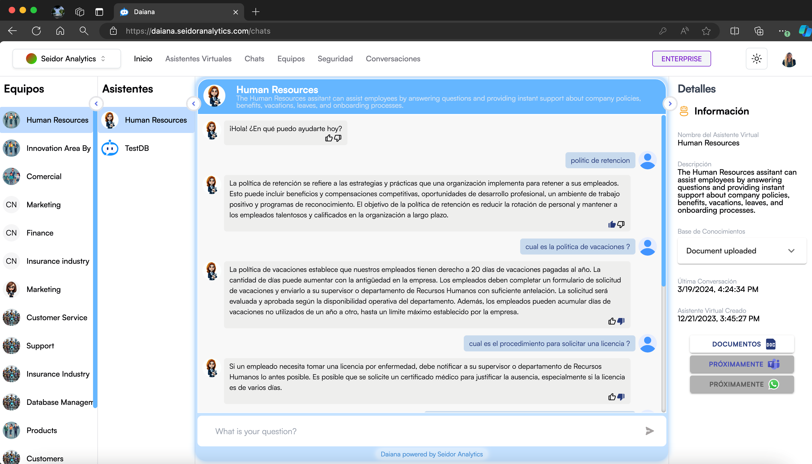

La pantalla de Chat de Asistentes Virtuales en Daiana permite a los usuarios interactuar con asistentes virtuales específicos para obtener respuestas instantáneas y soporte sobre diversas políticas y procedimientos de la empresa. Esta interfaz está organizada en secciones que facilitan la navegación y el uso eficiente de los asistentes.

## **Componentes de la Pantalla**

**1) Barra de Navegación Superior:**

-   **Tenant:** Identificación del Tenant asociado al usuario logueado.
-   **Menú de Navegación:** Incluye las secciones de Inicio, Asistentes Virtuales, Chats, Equipos, Seguridad y Conversaciones.
-   **Indicador de Plan:** Muestra el plan actual del usuario (por ejemplo, Enterprise).
-   **Icono de Tema:** Acceso a los tipos de temas de la plataforma (por ejemplo, Dark).
-   **Perfil del Usuario:** Acceso a las configuraciones de perfil y opciones de usuario.

**2) Panel de Equipos:**

-   **Lista de Equipos:** Ubicada a la izquierda, muestra los diferentes equipos disponibles en la plataforma. Cada equipo contiene uno o más asistentes virtuales.

**3) Panel de Asistentes:**

-   **Lista de Asistentes:** Muestra los asistentes virtuales disponibles dentro del equipo seleccionado. Los usuarios pueden seleccionar un asistente para iniciar una conversación.

**4) Panel de Chat:**

-   **Encabezado del Asistente:** Incluye el nombre y la descripción del asistente virtual seleccionado.
-   **Ventana de Conversación:** Área principal donde se visualizan las interacciones con el asistente virtual.
-   **Campo de Entrada de Mensajes:** Caja de texto en la parte inferior donde los usuarios pueden escribir sus preguntas o solicitudes.

**5) Panel de Detalles:**

-   **Información del Asistente:** Proporciona detalles adicionales sobre el asistente virtual seleccionado, como el nombre, descripción, base de conocimientos, última conversación y fecha de creación.
-   **Acceso a Documentos y Funciones Adicionales:** Enlaces rápidos para acceder a documentos relacionados y próximas funcionalidades.

## **Procedimientos y Funcionalidades**

**1) Seleccionar un Equipo:**

-   En el panel de equipos a la izquierda, haga clic en el nombre del equipo con el que desea interactuar. Esto actualizará la lista de asistentes disponibles en el panel de asistentes.

**2) Seleccionar un Asistente Virtual:**

-   En el panel de asistentes, haga clic en el asistente virtual con el que desea interactuar. La ventana de conversación se actualizará para mostrar la interacción con ese asistente.

**3) Enviar una Pregunta o Solicitud:**

-   Escriba su pregunta o solicitud en el campo de entrada de mensajes en la parte inferior de la ventana de conversación.
-   Presione la tecla Enter o haga clic en el icono de enviar para enviar su mensaje al asistente virtual.

**4) Revisar la Respuesta del Asistente:**

-   Las respuestas del asistente virtual aparecerán en la ventana de conversación. Puede ver el historial de interacciones en esta área para referencia.

**5) Consultar Detalles del Asistente:**

-   En el panel de detalles a la derecha, revise la información sobre el asistente virtual seleccionado, incluyendo su base de conocimientos y documentos asociados.

**6) Acceso a Documentos Relacionados:**

-   Haga clic en los enlaces disponibles en el panel de detalles para acceder a documentos específicos que pueden ser útiles para su consulta.