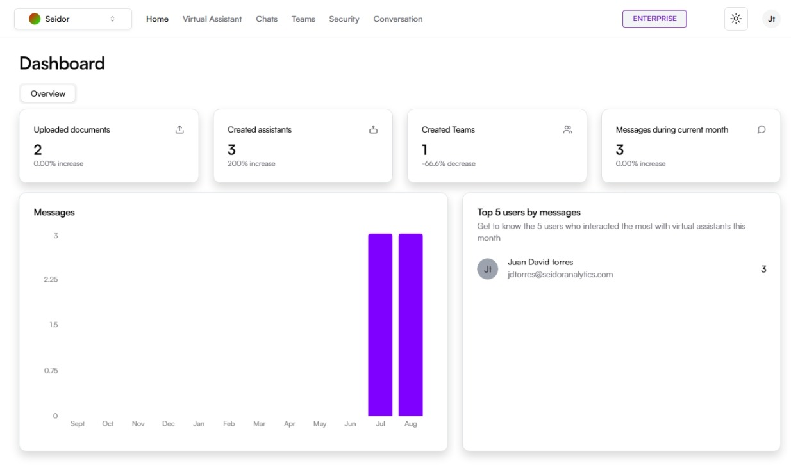

# Dashboard

El Dashboard es la pantalla principal que proporciona una vista resumida y analítica de la actividad y los datos gestionados en la plataforma. Está diseñado para ofrecer una visión rápida y clara del estado de los documentos, asistentes virtuales, equipos, y mensajes recibidos.

## **Componentes de la Pantalla**

**1) Barra de Navegación Superior:**

-   **Tenant:** Identificación del Tenant asociado al usuario logueado.
-   **Menú de Navegación:** Incluye las secciones de Inicio, Asistentes Virtuales, Chats, Equipos, Seguridad y Conversaciones.
-   **Indicador de Plan:** Muestra el plan actual del usuario (por ejemplo, Enterprise).
-   **Icono de Tema:** Acceso a los tipos de temas de la plataforma (por ejemplo, Dark).
-   **Perfil del Usuario:** Acceso a las configuraciones de perfil y opciones de usuario.

**2) Sección de Resumen:**

-   **Documentos Subidos:** Muestra el número total de documentos subidos y un enlace para acceder a los documentos recientes.
-   **Asistentes Creados:** Indica el número de asistentes virtuales creados en la plataforma.
-   **Equipos Creados:** Presenta el número de equipos creados.
-   **Total Mensaje Recibidos:** Indica el número total de mensajes recibidos en el sistema.

**3) Gráfico de Mensajes:**

-   **Mensajes Mensuales:** Gráfico de barras que muestra la cantidad de mensajes recibidos por mes, ofreciendo una perspectiva visual de la actividad de comunicación.

**4) Top 5 Usuarios por Mensajes:**

-   **Lista de Usuarios Activos:** Muestra los cinco usuarios que más han interactuado con los asistentes virtuales en el mes actual, junto con sus direcciones de correo electrónico y el número de interacciones.

## **Procedimientos y Funcionalidades**

**1) Acceder al Dashboard:**

Después de iniciar sesión en la plataforma Daiana, el usuario será dirigido automáticamente al Dashboard.

**2) Navegación en el Dashboard:**

Utilice la barra de navegación superior para desplazarse entre las diferentes secciones y funciones de la plataforma.

**3) Revisar Documentos Subidos:**

En la sección de “Documentos subidos”, haga clic en el icono de documentos para acceder a la lista de documentos recientemente cargados y gestionados.

**4) Crear y Gestionar Asistentes Virtuales:**

Consulte la sección “Asistentes creados” para ver los asistentes existentes. Para crear nuevos asistentes, navegue a la sección “Asistentes Virtuales” desde la barra de navegación.

**5) Administrar Equipos:**

En la sección “Equipos creados”, puede ver un resumen de los equipos existentes. Para administrar equipos, diríjase a la sección “Equipos” en la barra de navegación.

**6) Monitorear Actividad de Mensajes:**

El gráfico de mensajes proporciona una visión mensual de la actividad de mensajes recibidos.

**7) Identificar Usuarios Activos:**

La lista “Top 5 usuarios por mensajes” le permite identificar rápidamente a los usuarios más activos y sus niveles de interacción con los asistentes virtuales.