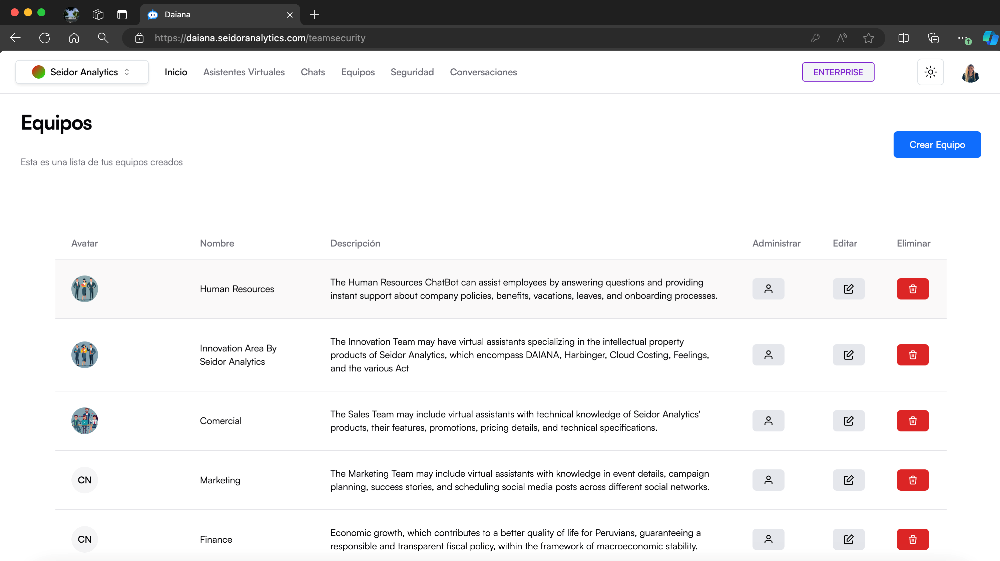
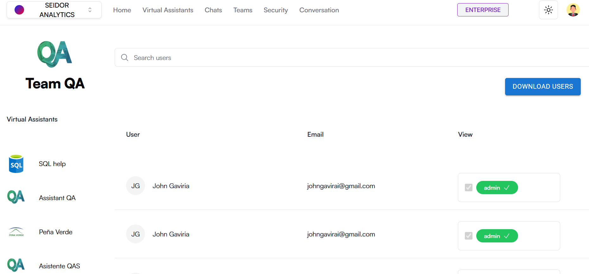

La pantalla de Equipos en Daiana permite a los usuarios ver, gestionar y crear equipos que agrupan a los asistentes virtuales por áreas o departamentos específicos. Esta vista ofrece una lista clara y organizada de todos los equipos creados, con opciones para administrar, editar o eliminar cada equipo.

## **Componentes de la Pantalla**

**1) Barra de Navegación Superior:**

-   **Tenant:** Identificación del Tenant asociado al usuario logueado.
-   **Menú de Navegación:** Incluye las secciones de Inicio, Asistentes Virtuales, Chats, Equipos, Seguridad y Conversaciones.
-   **Indicador de Plan:** Muestra el plan actual del usuario (por ejemplo, Enterprise).
-   **Icono de Tema:** Acceso a los tipos de temas de la plataforma (por ejemplo, Dark).
-   **Perfil del Usuario:** Acceso a las configuraciones de perfil y opciones de usuario.

**2) Encabezado de Equipos:**

-   **Título:** “Equipos” indica la sección actual de la plataforma.
-   **Botón “Crear Equipo”:** Botón azul a la derecha que permite crear un nuevo equipo.

**3) Lista de Equipos:**

**Columnas:**

-   **Avatar:** Icono representativo del equipo.
-   **Nombre:** Nombre del equipo.
-   **Descripción:** Breve descripción del equipo y sus funciones.
-   **Administrar:** Icono de persona para gestionar los miembros del equipo.
-   **Editar:** Icono de lápiz para editar la información del equipo.
-   **Eliminar:** Icono de papelera para eliminar el equipo.

## **Procedimientos y Funcionalidades**

**1) Crear un Nuevo Equipo:**

-   Haga clic en el botón “Crear Equipo”.
-   Complete el formulario con el nombre del equipo, descripción y otros detalles requeridos.
-   Haga clic en “Guardar” para crear el equipo.

**2) Administrar un Equipo:**

-   En la columna “Administrar”, haga clic en el icono de persona junto al equipo que desea gestionar.
-   Esta acción le llevará a una vista donde puede agregar o remover miembros del equipo y ajustar sus roles.

**3) Editar un Equipo:**

-   En la columna “Editar”, haga clic en el icono de lápiz junto al equipo que desea editar.
-   Modifique la información necesaria en el formulario que se despliega y haga clic en “Guardar” para actualizar los detalles del equipo.

**4) Eliminar un Equipo:**

-   En la columna “Eliminar”, haga clic en el icono de papelera junto al equipo que desea eliminar.
-   Confirme la acción en el cuadro de diálogo de confirmación para eliminar el equipo de forma permanente.

## **Procedimiento para crear un nuevo equipo**

A) Acceder a la Sección de Equipos

-   Desde la barra de navegación superior, seleccione “Equipos”.

B) Crear un Nuevo Equipo:

-   Haga clic en el botón “Crear Equipo”.

C) Configurar el Equipo

-   **Nombre del Equipo:** Ingrese un nombre único para el equipo en el campo correspondiente.
-   **Descripción**: Proporcione una breve descripción de las funciones del equipo.
-   **Avatar del Equipo**: Haga clic en “Seleccionar archivo” para cargar una imagen que representará al equipo(formatos permitidos: JPG, PNG, WEBP, SVG, tamaño máximo de 5 MB).

D) Crear el Equipo:

-   Haga clic en el botón “Crear Equipo” para guardar la configuración y crear el nuevo Equipo.

## **Procedimiento para administrar un equipo**

A) Acceder a la Sección de Equipos

-   Desde la barra de navegación superior, seleccione “Equipos”.

B) Administrar un Equipo:

-   haga clic en el icono de persona junto al equipo que desea gestionar.

C) Configurar el Equipo:

**Barra de Búsqueda:** ingresar términos para buscar asistentes virtuales específicos.

**Descargar Usuarios:** Al darle clic al botón “Descargar Usuarios”, se descargará en un formato XLSX, la lista de los usuarios que están en el equipo.

**Vista**: Si el rol del usuario es user, tendrá habilitado el checkbox, al activarlo, el usuario se agregará al equipo. Si el rol del usuario es admin, tendrá deshabilitado el checkbox.

## **Procedimiento para editar un equipo**

A) Acceder a la Sección de Equipos

-   Desde la barra de navegación superior, seleccione “Equipos”.

B) Editar un Equipo:

-   haga clic en el icono de lápiz junto al equipo que desea gestionar.

C) Configurar el Equipo:

-   **Nombre del Equipo:** Ingrese un nombre único para el equipo en el campo correspondiente.
-   **Descripción**: Proporcione una breve descripción de las funciones del equipo.
-   **Avatar del Equipo**: Haga clic en “Seleccionar archivo” para cargar una imagen que representará al equipo(formatos permitidos: JPG, PNG, WEBP, SVG, tamaño máximo de 5 MB).

D) Editar el Equipo:

-   Haga clic en el botón “Editar Equipo” para guardar la configuración y editar el Equipo.

## **Procedimiento para eliminar un equipo**

A) Acceder a la Sección de Equipos

-   Desde la barra de navegación superior, seleccione “Equipos”.

B) Eliminar un Equipo:

-   haga clic en el icono de basura junto al equipo que desea eliminar.
-   Para confirmar, haga clic en el botón “Eliminar”.