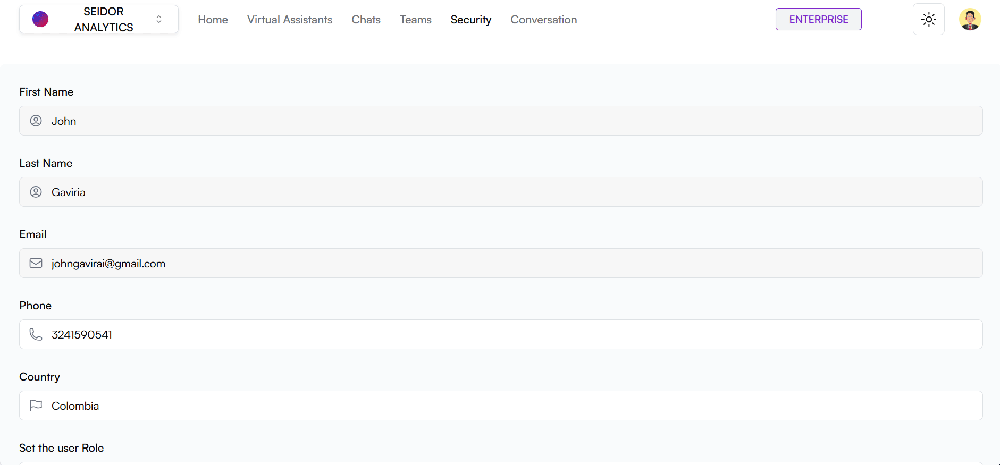
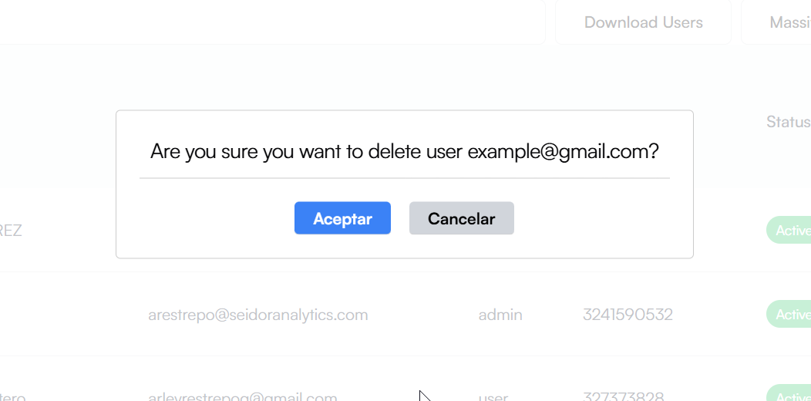

La pantalla de Seguridad en Daiana permite a los administradores gestionar los usuarios de la plataforma, incluyendo la creación, edición y eliminación de cuentas de usuario. También ofrece una visión general de los roles y estados de los usuarios.

## Componentes de la Pantalla

**1) Barra de Navegación Superior:**

-   **Tenant:** Identificación del Tenant asociado al usuario logueado.
-   **Menú de Navegación:** Incluye las secciones de Inicio, Asistentes Virtuales, Chats, Equipos, Seguridad y Conversaciones.
-   **Indicador de Plan:** Muestra el plan actual del usuario (por ejemplo, Enterprise).
-   **Icono de Tema:** Acceso a los tipos de temas de la plataforma (por ejemplo, Dark).
-   **Perfil del Usuario:** Acceso a las configuraciones de perfil y opciones de usuario.

**2) Encabezado de Seguridad:**

-   **Título:** “Seguridad” indica la sección actual de la plataforma.
-   **Botón “Descargar Usuarios”:** Botón blanco a la derecha que permite descargar la lista de usuarios en formato XLSX.
-   **Botón “Carga Masiva”:** Botón blanco a la derecha que permite invitar a miembros del equipo.
-   **Botón “Massive Upload”:** Botón azul a la derecha que permite agregar un nuevo usuario.

**3) Barra de Búsqueda:**

-   **Campo de Búsqueda:** Caja de texto donde los administradores pueden ingresar términos para buscar usuarios específicos.

**4) Lista de Usuarios:**

**Columnas:**

-   **Usuario:** Nombre e imagen de perfil del usuario.
-   **Correo Electrónico:** Dirección de correo electrónico del usuario.
-   **Rol:** Rol asignado al usuario. Los roles disponibles en la aplicación son:

1.  **Admin:** Este rol habilita el acceso a todas las funcionalidades.
2.  **Creator:** Con este rol el usuario solo llegar hasta poder crear asistentes virtuales. No puede administrar equipos ni usuarios.
3.  **User:** El usuario solo puede chatear con asistentes virtuales. No puede administrar ni equipos, ni usuarios, ni asistentes virtuales.

-   **Teléfono:** Número de teléfono de contacto del usuario.
-   **Estado:** Estado actual del usuario (por ejemplo, Activo, Inactivo).
-   **Editar:** Icono de lápiz para editar la información del usuario.
-   **Eliminar:** Icono de papelera para eliminar el usuario.

## Procedimientos y Funcionalidades

**1) Crear un Nuevo Usuario:**

-   Haga clic en el botón “Crear Usuario”.
-   Complete el formulario con la información requerida, incluyendo nombre, correo electrónico, rol, teléfono y estado.
-   Haga clic en “Guardar” para agregar el nuevo usuario.

**2) Buscar un Usuario:**

-   Ingrese el nombre, correo electrónico u otra información relevante en el campo de búsqueda para localizar usuarios específicos rápidamente.

**3) Editar un Usuario:**

-   En la columna “Editar”, haga clic en el icono de lápiz junto al usuario que desea editar.
-   Modifique la información necesaria en el formulario que se despliega y haga clic en “Guardar” para actualizar los detalles del usuario.

**4) Eliminar un Usuario:**

-   En la columna “Eliminar”, haga clic en el icono de papelera junto al usuario que desea eliminar.
-   Confirme la acción en el cuadro de diálogo de confirmación para eliminar el usuario de forma permanente.

**5) Descargar Usuarios:**

-   Haga clic en el botón “Descargar Usuarios”.

**6) Invitar miembros del equipo:**

-   Haga clic en el botón “Massive Upload”.
-   Invita a los nuevos miembros del equipo.
-   Haga clic en “Enviar Invitaciones” para invitar a los nuevos miembros.

## Procedimiento para crear un nuevo usuario

A) Acceder a la Sección de Seguridad

-   Desde la barra de navegación superior, seleccione “Seguridad”.

B) Crear un Nuevo Usuario:

-   Haga clic en el botón “Crear Usuario”.

C) Configurar el Usuario

-   **Nombre del Usuario:** Ingrese el nombre del usuario en el campo correspondiente.
-   **Apellido del Usuario:** Ingrese el apellidodel usuario en el campo correspondiente.
-   **Correo electrónico del Usuario:** Ingrese el correo electrónico del usuario en el campo correspondiente.
-   **Contraseña del Usuario:** Ingrese la contraseña del usuario en el campo correspondiente.
-   **Teléfono del Usuario:** Ingrese el teléfono del usuario en el campo correspondiente.
-   **País del Usuario:** Ingrese el país del usuario en el campo correspondiente.
-   **Rol del Usuario:** Seleccione el rol que tendrá el usuario.

D) Crear el Usuario:

-   Haga clic en el botón “Crear Usuario” para guardar la configuración y crear el nuevo Usuario.

## Procedimiento para editar un usuario

A) Acceder a la Sección de Seguridad

-   Desde la barra de navegación superior, seleccione “Seguridad”.

B) Editar un Usuario:

-   haga clic en el icono de lápiz junto al equipo que desea gestionar.

C) Configurar el Usuario

-   **Teléfono del Usuario:** Ingrese el teléfono del usuario en el campo correspondiente.
-   **País del Usuario:** Ingrese el país del usuario en el campo correspondiente.
-   **Rol del Usuario:** Seleccione el rol que tendrá el usuario.

D) Editar el Usuario:

-   Haga clic en el botón “Editar Usuario” para guardar la configuración y editar el Usuario.

## Procedimiento para eliminar un usuario

A) Acceder a la Sección de Usuarios

-   Desde la barra de navegación superior, seleccione “Usuarios”.

B) Eliminar un Usuario:

-   haga clic en el icono de basura junto al equipo que desea eliminar.
-   Para confirmar, haga clic en el botón “Aceptar”.

## Procedimiento para invitar nuevos miembros al equipo

A) Acceder a la Sección de Seguridad

-   Desde la barra de navegación superior, seleccione “Seguridad”.

B) Invitar a nuevos miembros al equipo:

-   Haga clic en el botón “Massive Upload”.

C) Configurar la invitación

-   **Seleccionar equipo:** Seleccione el o los equipo al que ingresarán las personas invitadas dándole clic al botón “Agregar”.
-   **Invitación masiva**: Introduzca las direcciones de correo electrónico de las personas a las que desea invitar. separe las entradas por comas, punto y coma, pipes o espacio. Max 100 correos.

D) Enviar Invitaciones:

-   Haga clic en el botón “Enviar Invitaciones” para guardar la configuración y enviar las invitaciones.