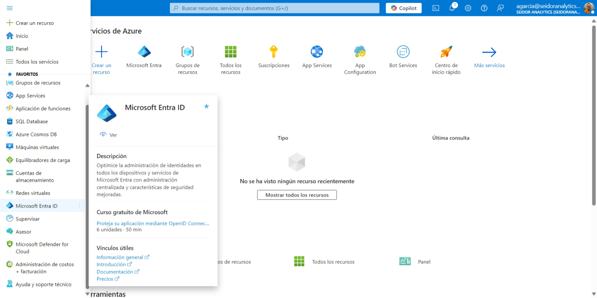
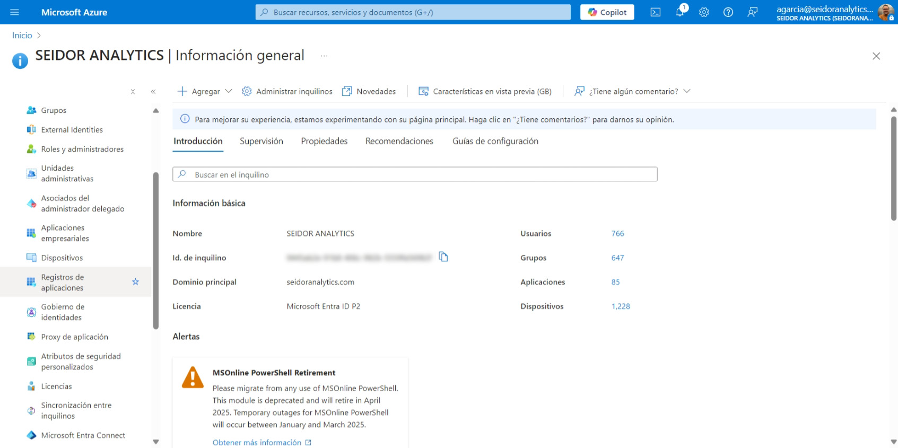
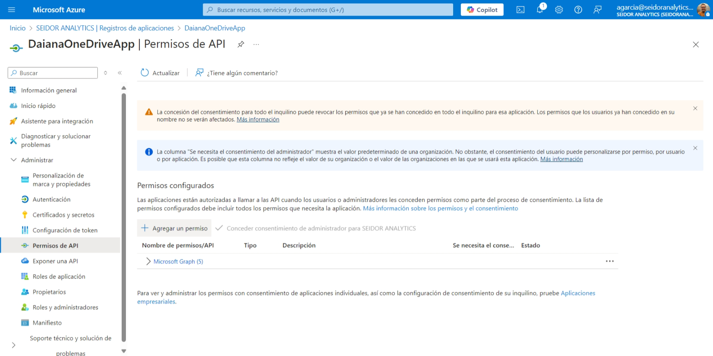
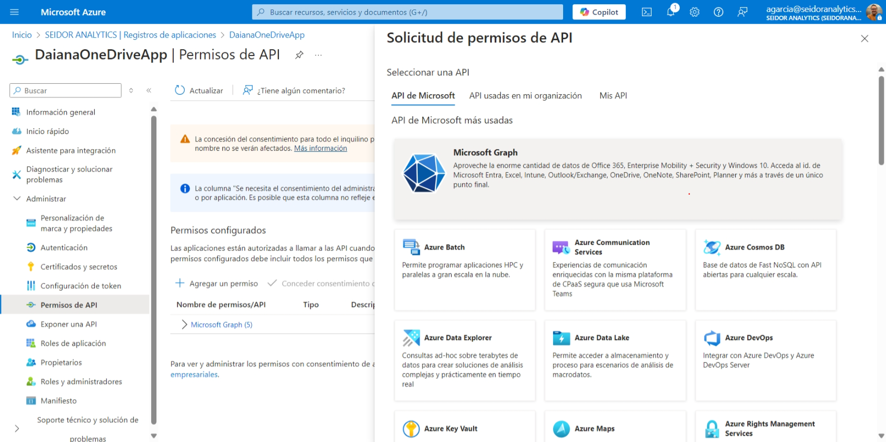
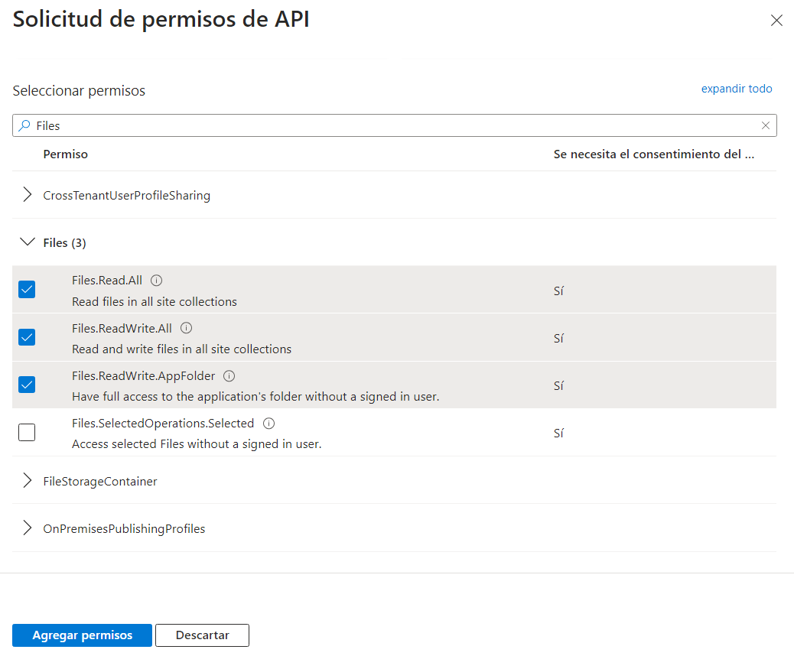
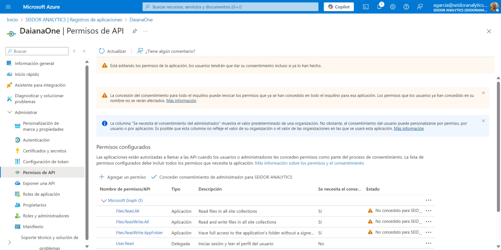
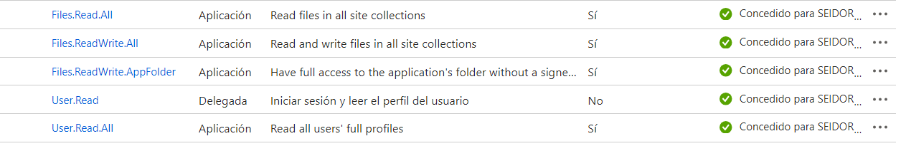
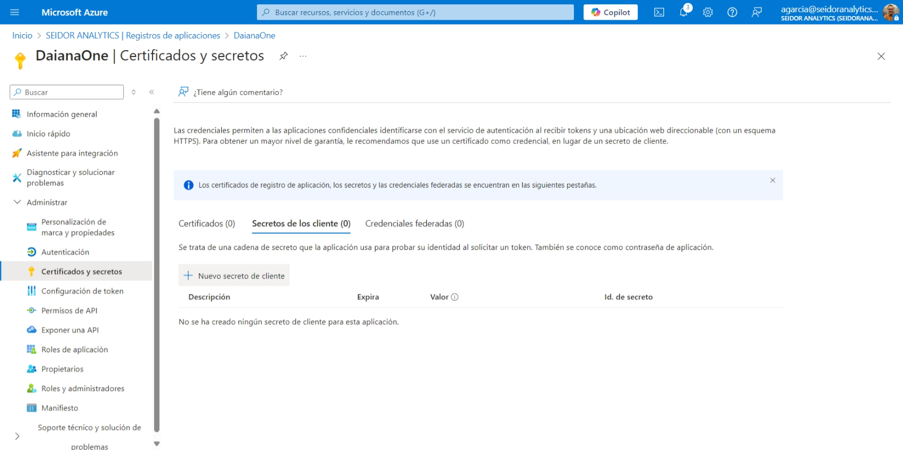

## Herramientas necesarias
En esta guía encontrara detalladamente los pasos para generar una aplicación en One Drive, asignar roles, obtener las credenciales de acceso y los identificadores de su carpeta ShareFolder.

En este párrafo encontrara las credenciales que necesitaremos cargar en la aplicación de Daiana:
- Acceso Azure Active directory
- **icrosoft Graph**: acceso a la API de Microsoft Graph

Documentación para Registrar una App en el Portal de Azure y Otorgar Permisos a la API de Microsoft Graph

## 1. Acceso al Portal de Azure

1.	Ve al [Portal de Azure](https://portal.azure.com/).
2.	Inicia sesión con tu cuenta de Microsoft.

## 2. Registro de la Aplicación
1. En el menú de navegación izquierdo, selecciona  **Microsoft Entra ID**.

2.	Haz clic en Registros de **aplicaciones > Nuevo registro.**

3.	Completa los siguientes campos:

-	Nombre: Asigna un nombre único a tu aplicación.
-	Tipos de cuentas admitidos: Elige el alcance de autenticación (por ejemplo, "Cuentas en este directorio organizativo").
- 	URI de redirección (opcional): Si necesitas autenticación interactiva, proporciona un URI válido (por ejemplo https://localhost:3000/auth/callback). 

:::danger
**NOTA**: no es requerido en nuestro caso, omitir.
::::

4.	Haz clic en Registrar

## 3. Configurar Permisos para Microsoft Graph
1.	Ve a la página de la aplicación registrada.

2. En el menú lateral, selecciona **Permisos de la API.**

3.	Haz clic en **Agregar permiso**.

4.	Selecciona Microsoft Graph.

5.	Escoge el tipo de permiso:

-	Permisos delegados: Si la aplicación actúa en nombre del usuario.
-	Permisos de aplicación: Si la aplicación actúa de forma independiente. 

:::danger
 **NOTA**: para nuestro caso seleccionamos esta opción.
::::

6.	Busca y selecciona los permisos necesarios, por ejemplo:

7.	Haz clic en **Agregar permisos**.

## 4. Conceder Consentimiento del Administrador (Opcional)

1.	Si los permisos requieren consentimiento del administrador, haz clic en **Conceder consentimiento de administrador para [tu inquilino]**.

2.	Confirma la acción.
3.	Cuando el administrador haya dado de alta los permisos se vera algo así:

## 5. Configurar un Secreto de Cliente (Client Secret)
1.	En la configuración de la aplicación, selecciona Certificados y secretos.

2.	Haz clic en Nuevo secreto de cliente.

3.	Asigna una descripción y establece la duración del secreto.

4.	Haz clic en Agregar.
5.	Copia el Valor del Secreto y guárdalo de manera segura.

## 6.Obtener las Credenciales de la Aplicación
- Ve a Información general para obtener el **ID de aplicación (cliente)** y el **ID de directorio (inquilino)**.
-	Estos serán necesarios para autenticar tu aplicación al consumir la API de **Microsoft Graph en Daiana**.

## 7.Crear asistente en Daiana 

Nos dirigimos a crear un nuevo asistente para Daiana y elegimos en “Connection Type” One Drive  

Nos dirigimos a “Sources” y completamos con nuestras credenciales. Una vez completado este paso, esperamos que los documentos del One Drive se carguen en el asistente y, en el caso de ser una carga exitosa, veremos en la tabla de abajo los documentos del OneDrive.  
