**Herramientas necesarias**: Acceso Azure Active directory, Postman 

En esta guía encontrara detalladamente los pasos para generar una aplicación en Azure, asignar roles, obtener las credenciales de acceso y los identificadores de su carpeta ShareFolder. 

En este párrafo encontrara las credenciales que necesitaremos cargar en la aplicación de Daiana: 

**ClientId**: Este es el identificador único de la aplicación que crearemos en Azure para poder leer nuestra carpeta de ShareFolder. 

**ClientSecret**: Esta es la clave secreta de la aplicación, con la que permitiremos los accesos de nuestra aplicación en ShareFolder. 

**TenantId**: Este es el identificador del dueño de la aplicación, indicando en donde fue creada  

**DomainId**: El domain ID pertenece a nuestro ShareFolder y es el ID de nuestras carpetas que contienen los archivos  

### Paso 1: Creación de la aplicación en Azure  
Desde el inicio del portal Azure debemos dirigirnos a nuestro Azure Active Directory  

En esta vista debemos apretar en “Add” y clickear en “App Registration” 
 
.png)
 
Debemos elegir el nombre de nuestra aplicación y, si esta pertenece a un solo tenant o si puede acceder a diferentes tenant, en este caso la opción “Single tenant” cumple con el requisito mientras el SharePoint se encuentre en el mismo tenant. 

Los campos opcionales quedaran vacíos. 

Una vez nuestra app queda registrada estaremos en una pantalla de este tipo en donde obtendremos el  client ID el tenant ID (cuadros azules) y el paso siguiente será obtener nuestra key secreta: 

Damos click en el cuadro rojo en “Add a certificate or secret”. En esta vista debemos elegir “New Client Secret” y elegimos la descripción de esta clave que se genera. 

Cuando aceptemos, debemos copiar estos dos valores que se generan (usaremos para la conexión es el campo “Value”).  

Si cumplimos con todos los pasos ya obtuvimos las siguientes keys: client ID, tenant ID y clientSecret. 

### Paso 2: Configuración de permisos  
En este paso configuraremos los permisos de nuestra aplicación para que pueda leer y ver los archivos de nuestro ShareFolder mediante la aplicación de Azure.  

Desde nuestra aplicación debes ir a “API permissions” y luego en “Add a permission” 

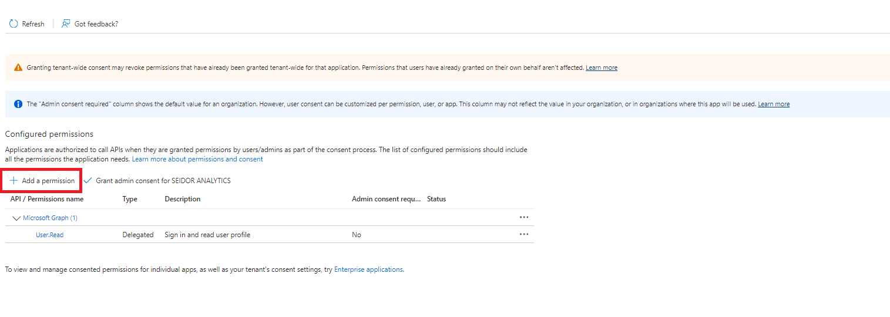
En esta vista seleccionamos “Microsoft Graph”  

Luego en “Application permissions”  

Debemos repetir este paso por cada permiso que debe concederse en la aplicación:  

Sites > Sites.FullControll.All  

Files>Files.ReadWrite.All 

Browser>Browser.SiteLists.ReadWrite.All

Una vez otorgados estos permisos, deben ser aprobados por un administrador (o nosotros mismos si tenemos los permisos necesarios en el Portal Azure). 
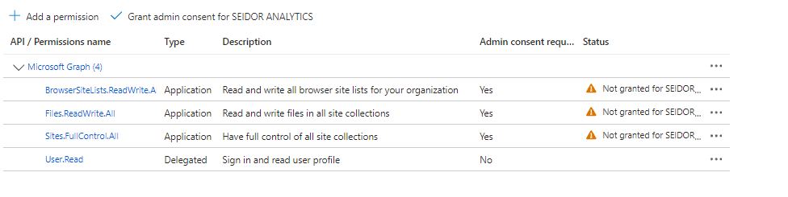

Una vez aprobados estos permisos, se visualizará de la siguiente manera:  
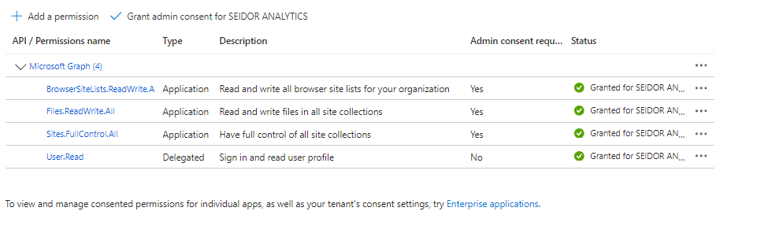

### Paso 3: Obtención identificador de carpeta ShareFolder 
En este paso obtendremos nuestro ID de nuestro ShareFolder, en el que necesitaremos la herramienta de peticiones Postman  y las credenciales de nuestra aplicación en Azure que conseguimos en los pasos anteriores:  

Una vez estemos en nuestra herramienta postman debemos configurar una petición a este link: ``https://login.microsoftonline.com/{tenantId}/oauth2/token`` reemplazando el ``{tenantId}`` con nuestra credencial de tenant ID. 

Seleccionar opciones en Body: 
- Selecciona Body. 
- Selecciona "x-www-form-urlencoded" (cuadros rojos). 

Cargar los siguientes campos en el formulario: 
- **grant_type**: client_credentials 
- **client_id**: [valor de tu credencial de Azure] 
- **resource**: https://graph.microsoft.com/ 
- **client_secret**: [valor de tu credencial de Azure] 

Agregar tenantId a nuestro link: 
- Incluye tu tenantId en el enlace. 

Formato final de la petición: 
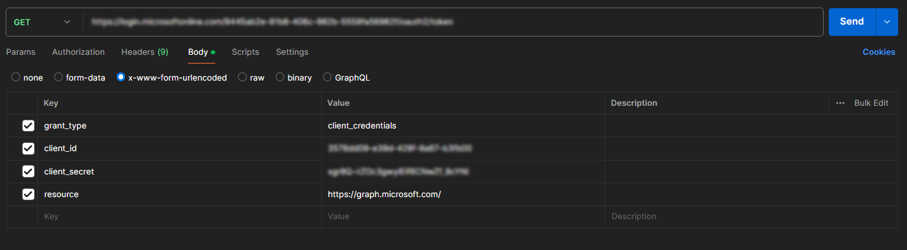

Damos click en send y obtendremos una respuesta en este formato: 
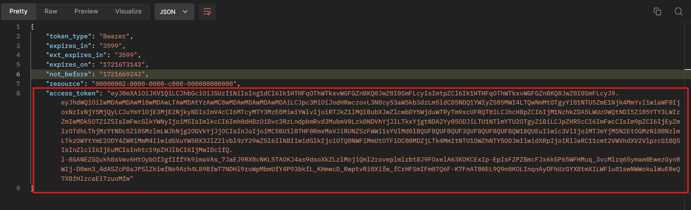

De esta respuesta necesitamos el valor dentro de “Access_token”, copiamos sin las comillas dobles. 

Una vez obtengamos nuestro token debemos hacer una petición a un nuevo link en este caso será a: https://graph.microsoft.com/v1.0/sites  

Este endpoint nos otorgara la lista de nuestros SharePoint en nuestro tenant de azure y nos otorgara nuestro DomainId. 

Una vez tengamos nuestra petición configurada en el link proporcionado 

Debemos elegir la opción Bearer Token en Authorization (cuadros rojos) y debemos poner el bearer token que copiamos en el paso anterior en  el input Token (Cuadro azul) 

La pantalla con el token cargado debe quedar de la siguiente manera: 

Le damos a send y obtendremos una lista en siguiente formato:  
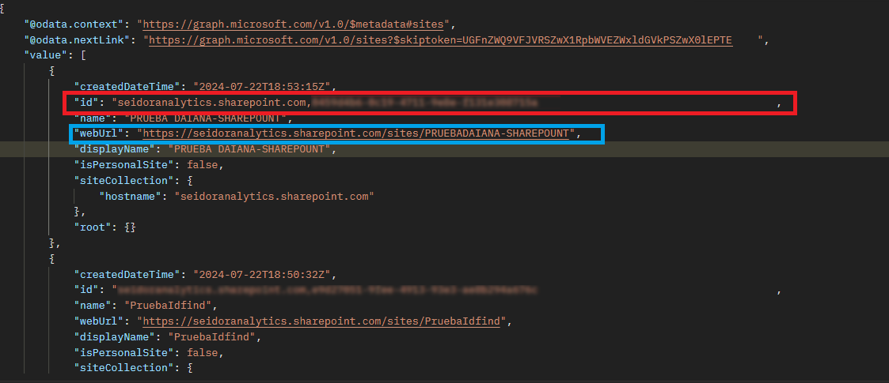

El dato que necesitamos es el “id” (cuadro rojo) 

Cuando busquemos nuestro SharePoint en específico debemos buscar por nuestra dirección de SharePoint. 

Por ejemplo, la dirección de la carpeta SharePoint que busco es: https://seidoranalytics.sharepoint.com/sites/sharepointfeature/Documentos%20compartidos/Forms/ 

Nosotros necesitamos hasta el slash después de sites 
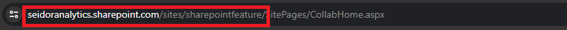

Luego en postman hacemos click sobre la lupa de búsqueda y pegamos la dirección y obtenemos el valor del “Id” 
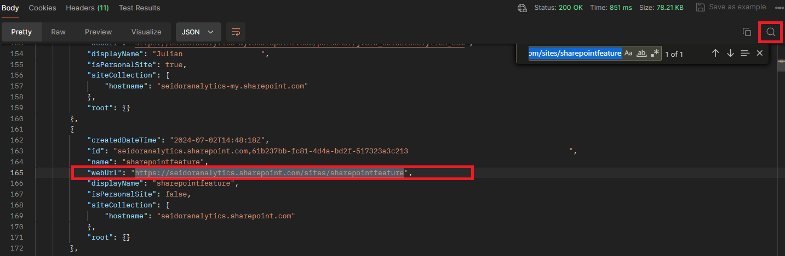

En el caso que no lo encontremos es posible que se encuentre en la página siguiente, para acceder a esta página debemos hacer click en el principio de la respuesta. 

Se abre esta petición en donde debemos elegir el auth Type sea Bearer Token y pegar nuestro bearer. 

Al darle send podemos obtener la misma lista, pero de la página siguiente y repetimos el paso de búsqueda. 

El domainId este compuesto por la url seguido de dos IDS 

Ejemplo:  

`seidoranalytics-my.sharepoint.com,9321ae0e-db0b-4982-9636-c907593046b7,9393cd16-2bad-4842-8729-e987bc7c94a9 `

Una vez completados estos pasos debemos tener las siguientes claves: clientId, clientSecret, tenantId y domainId perteneciente a nuestro SharePoint. 

El paso siguiente es cargar nuestro asistente de Daiana con nuestras claves. 

### Paso 4: Crear asistente en Daiana 

Nos dirigimos a crear un nuevo asistente para Daiana y elegimos en “Connection Type” SharePoint  

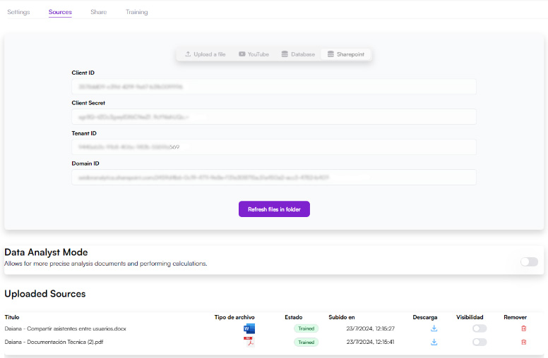

Nos dirigimos a “Sources” y completamos con nuestras credenciales. Una vez completado este paso, esperamos que los documentos del SharePoint se carguen en el asistente y, en el caso de ser una carga exitosa, veremos en la tabla de abajo los documentos del SharePoint.  

En este caso, la subida de archivos será, en su totalidad, desde la raíz del SharePoint. 

Una vez verificamos la existencia de nuestros archivos, el asistente estará listo para responder preguntas.  

#### Conexión de carpeta a asistente de SharePoint :  
Si deseamos conectar nuestro asistente a una carpeta especifica de SharePoint, podemos seleccionar la opción “Upload document from folder”. De esta forma escribimos el nombre de nuestra carpeta y se cargaran los archivos que ésta contenga. 

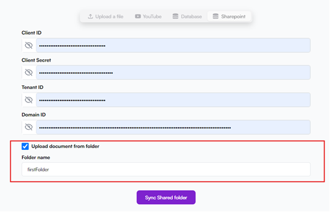

Al aceptar esta opción tendremos el input para cargar el nombre de nuestra carpeta, no es case sensitive (es decir funciona de la misma forma si es mayúscula o minúscula) pero si respeta espacios (Por ejemplo: “Primera carpeta”). 

En caso de acceder a subcarpetas la dirección se va indicando con “/”, de la siguiente manera: 
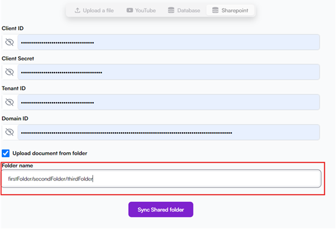

NOTA: Para el folder name, tener en cuenta en NO colocar un Slash al final "/". 

 El contenido que trae es desde la carpeta indicada, si por ejemplo seleccionamos “thirdFolder” como en el ejemplo, traerá todos los documentos desde esa carpeta en adelante. 

