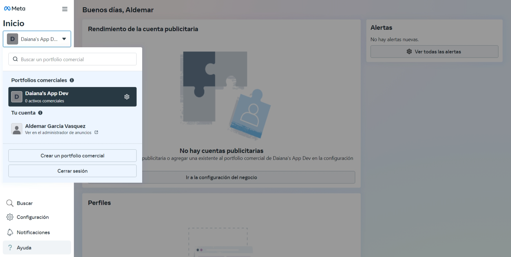
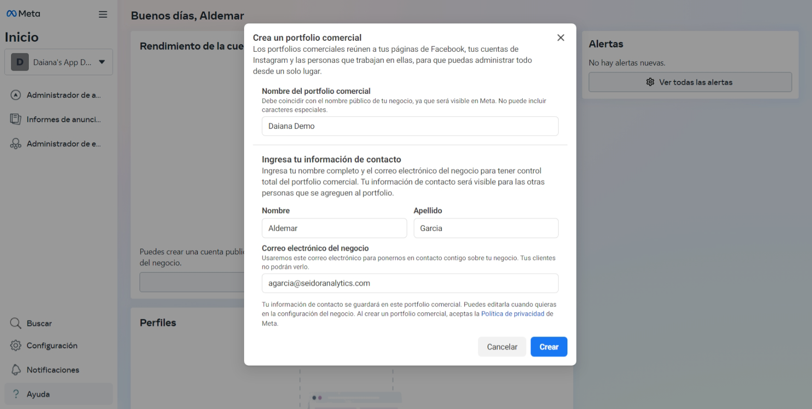
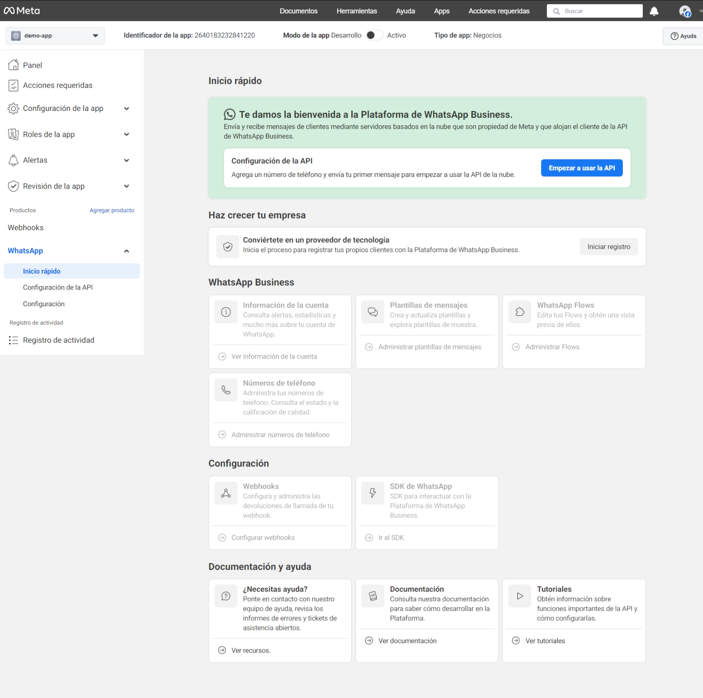
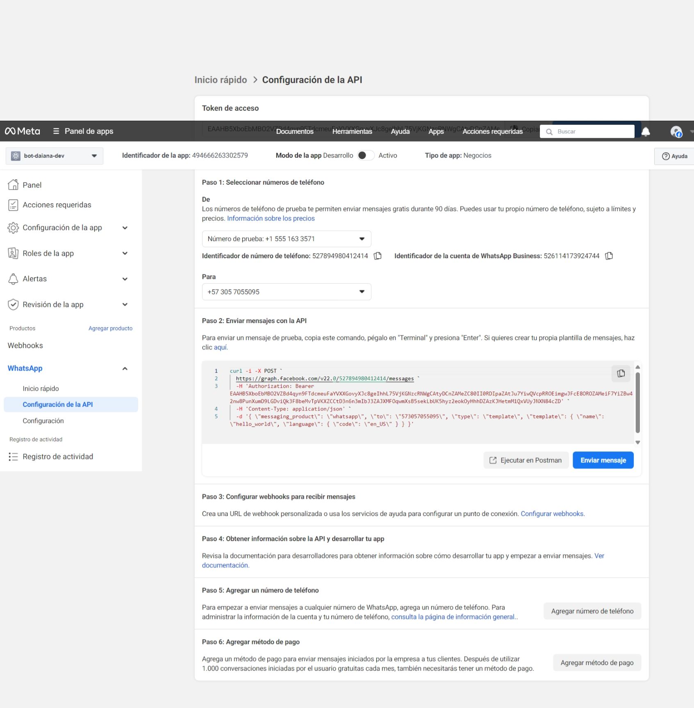
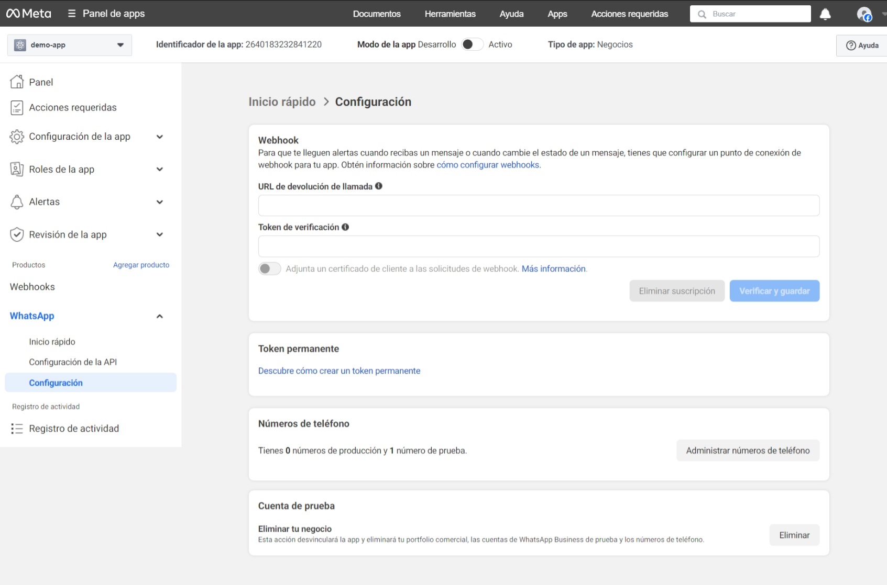
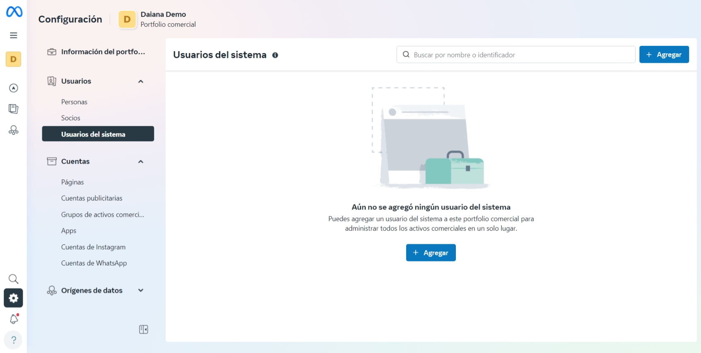
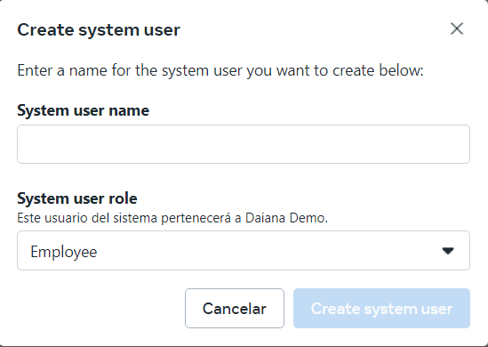
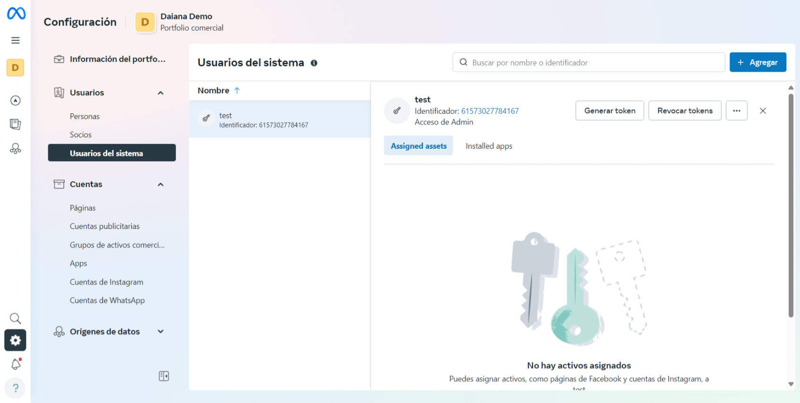
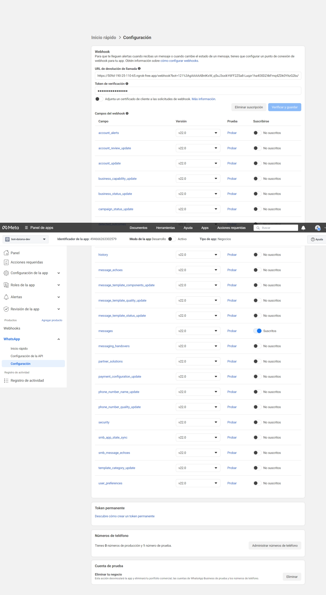

## Creación de un Webhook para WhatsApp

**Introducción**
Un **webhook** es un mecanismo que permite recibir notificaciones automáticas en un servidor cuando ocurren ciertos eventos en una plataforma externa. En este caso, crearemos un webhook para WhatsApp que recibirá mensajes entrantes y eventos desde la **API de WhatsApp Cloud de Meta.**

Esta guía cubre los siguientes aspectos:
- Creación y configuración de un webhook

## Requisitos Previos

Antes de comenzar, asegúrese de contar con:
-	Una cuenta de Meta for Developers más instrucciones [aqui](https://developers.facebook.com/docs/development/register)
-	Una cuenta en Meta Business Suite para configurar el webhook [link](https://business.facebook.com/)
-	Una línea telefónica nueva o una que no hayas sido usada en WhatsApp.

## Configuración del Webhook en Meta
### Creación del Portafolio comercia

1.	Ingresa a [Meta Business Suite](https://business.facebook.com/)
2. Seguir las instrucciones para cear una, si por lo contrario quieres crear una nueva sigue estos pasos:
a. Clic en el recuadro debajo de inicio y luego en **Crear un portafolio comercial.**

b. Rellena los datos solicitados en el formulario y clic en crear. 

c.	Clic en **siguiente.** 

d.	Clic en **siguiente.** 

e.	Clic en **confirmar.** 

### Creación de una Aplicación en Meta Developers

1. Ingrese a [Meta for Developers](https://developers.facebook.com/)
2.	Seleccione mis apps y luego crear app.

3.	Siga el paso a paso
a.	Dar un nombre a la aplicación

b. Seleccione otro en caso de usos

c. Selecciones **Negocios**

d. Aquí debe seleccionar el portafolio comercial creado previamente. **Clic en crear app**.

4.	Vaya a la sección WhatsApp 
a.	WhatsApp clic en configurar

Si tienes una cuenta comercial de Meta (MBA), se te pedirá que la adjuntes cuando agregues el producto WhatsApp a tu app. Si no tienes una MBA, deberás seguir unas instrucciones que te ayudarán a crear una. Una vez que adjuntes la MBA a tu app, tendrás todo listo para empezar a hacer las pruebas.
b.Selecciones **Continuar**

c. Clic en **Empezar a usar la API**

d. Clic en Generar token de acceso y sigue los pasos para loguearte y obtener un token.temporal.

e. Agrega un número de teléfono para hacer una prueba de conexión con el servidor, y sigue los pasos de las imágenes. 

 
f.Cambia al prefijo de tu país y coloca el numero con el que vas hacer la prueba

g.Ingresa el código de verificaron recibido en el móvil.

h. Clic en **Enviar mensaje**, deberías poder recibir un mensaje de prueba en tu **WhatsApp**.

## Configuración del Webhook
1.	En paso 3, haz clic en **Configurar webhooks**.

2.	Veras una página como esta

3. Es momento de generar un token permanente que deberás agregarlo a la configuración de DAIANA. Mas información [clic aquí.](https://developers.facebook.com/docs/whatsapp/business-management-api/get-started#business-integration-system-user-access-tokens)

	Para generar un token del sistema, accede al panel [Configuración del negocio](https://business.facebook.com/business/loginpage/?next=https%3A%2F%2Fbusiness.facebook.com%2Fsettings%2F) selecciona el negocio creado y haz clic en Usuarios del sistema:
  

Haz clic en el botón +Agregar y, cuando aparezca la ventana Crear usuario del sistema, ingresa un nombre de usuario del sistema y asígnale el rol Administrador o Empleado:

Una vez que el usuario administrador del sistema se haya creado, aparecerá en la lista de usuarios del sistema. Haz clic en el nombre del usuario del sistema para mostrar la imagen superpuesta de la asignación del activo.

Haz clic en el botón Asignar activos para mostrar la ventana **Seleccionar activos y asignar permisos:**

Selecciona tu app y otórgale a tu usuario del sistema el permiso **Administrar app**. Luego, haz clic en el botón Asignar activos para confirmar y cerrar la ventana.

Una vez de regreso en el panel Usuarios del sistema, vuelve a cargar la página para confirmar que a tu usuario del sistema se le haya concedido el permiso Control total de tu app. Es posible que se demore un poco la concesión de los permisos, así que deja pasar unos minutos y vuelve a cargar la página si tu app no aparece como un activo asignado. Cuando el activo se haya asignado, debería tener el siguiente aspecto:

Cuando veas que a tu usuario del sistema se le otorgó el control total de tu app, en la imagen superpuesta de la asignación del activo, haz clic en el botón Generar token. En la ventana que aparece, selecciona tu app, elige una preferencia de caducidad del token y asigna a tu app estos tres permisos de la API Graph:

- business_management
- whatsapp_business_management
- whatsapp_business_management

Puedes buscar "business" para encontrar estos permisos rápidamente:

4.	Agregue la URL de su servidor que encontraras en la configuración de Daiana (por ejemplo, https://tudominio.com/webhook)
5.	Ingrese el VERIFY_TOKEN definido en la configuración de DAIANA

	Hasta ahora deberías tener en la configuración de DAIANA los tres datos requeridos para su funcionamiento, el identificador del número telefónico (paso 4.a), el token creado anteriormente (paso 3.2-3) y el VERIFY_TOKEN (clave de su preferencia) que deberá ser el mismo en ambos. Clic en Verificar y guardar.

6.	Seleccione los eventos que desea recibir (mensajes, estados, etc.)

Hasta este punto solo hemos configurado el modo de desarrollo de la aplicación, para poder llevarlo a productivo deberá agregar un umero de teléfono real, sigue las instrucciones en este [link.](https://developers.facebook.com/docs/whatsapp/cloud-api/phone-numbers)

Por último, deberás cambiar el modo de la app Desarrollo a Activo en la parte superior.

