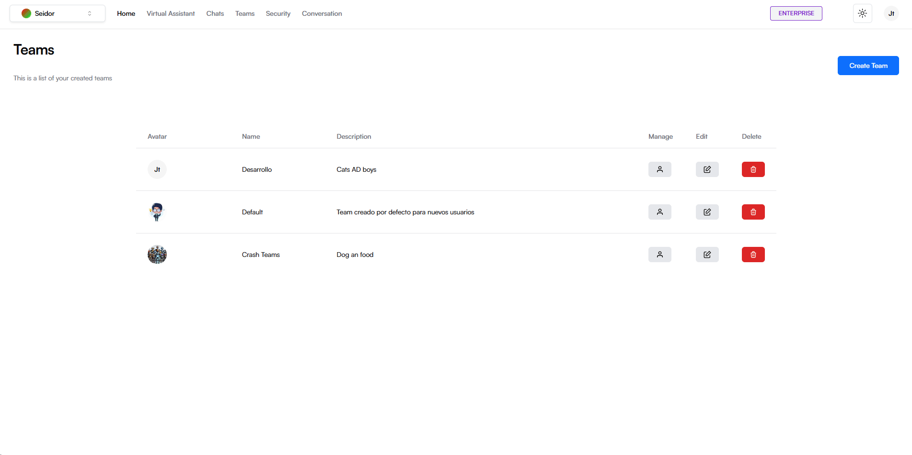
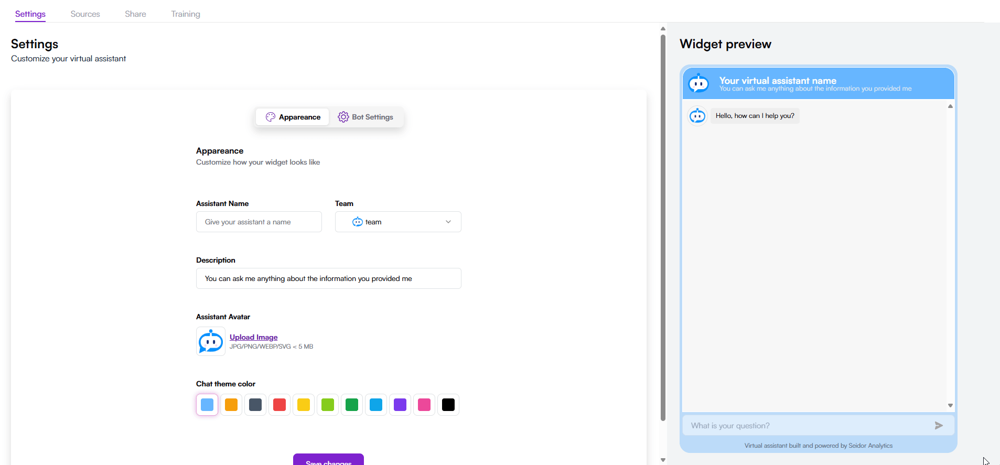

Empecemos por configurar todos los elementos necesarios para tu primer asistente 

## Crear un equipo

Para este paso, iniciaremos creando y configurando un equipo que se encargará de gestionar la información proporcionada por el asistente virtual. Esto es esencial, ya que únicamente los miembros del equipo tendrán acceso a la información retornada por el asistente, asegurando así la seguridad y el manejo adecuado de los datos.

## Genere tu primer asistente virtual 

Una vez que el equipo esté creado, podremos generar nuestro primer asistente virtual, que estará disponible exclusivamente para los miembros del equipo. (Para obtener información sobre los miembros del equipo, consulte este enlace).

Para esto nos dirigiremos a la sección de [Virtual Assistant](https://daianadmo.seidoranalytics.com/virtual-assistants) en la barra de navegación.  
 

Una vez en esta sección generaremos nuestro asistente virtual con el botón **“New virtual assistant”** ubicado en la parte derecha superior de la sección.

Ahora configuraremos los elementos fundamentales de nuestro asistente, incluyendo el nombre y el equipo que tendrá acceso al asistente virtual, así como el tipo de conexión que utilizará, ya sea a través de datos de una base de datos o de documentos de texto y/o videos. También ajustaremos detalles estéticos como el color del chat, el avatar y la descripción.

### Alimentemos al asistente virtual

los asistentes virtuales de Daiana solo son alimentados por la información que carguemos a nuestros asistentes virtuales. No solo para mantener tus datos seguros, sino además para brindar solo las respuestas necesarias para tu compañía.  
En este ejemplo cargaremos documentos para el aprendizaje de este asistente, pero sí requiere configurar para base de datos, por favor consulte el siguiente enlace. 

  
Una vez seleccionado el archivo, entrenaremos a nuestro asistente con esta información.

 Podrá verificar, desactivar y eliminar todos los documentos cargados al robot en la sección final de esta página.

