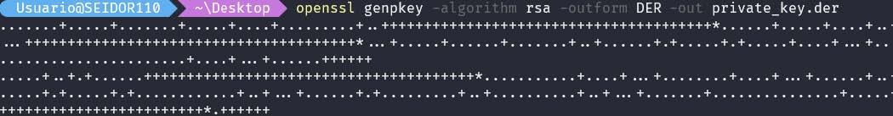
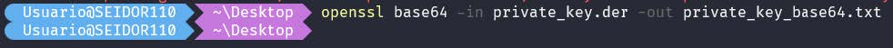
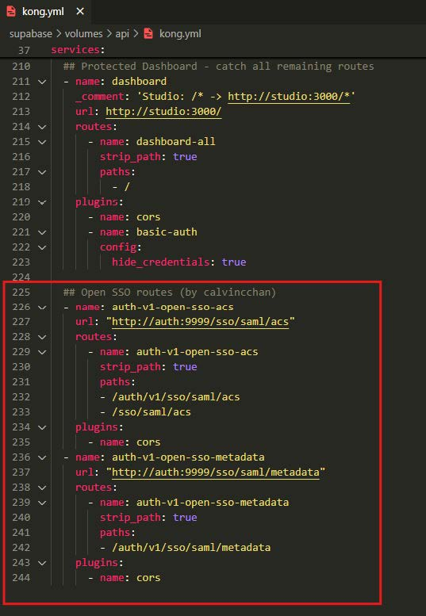
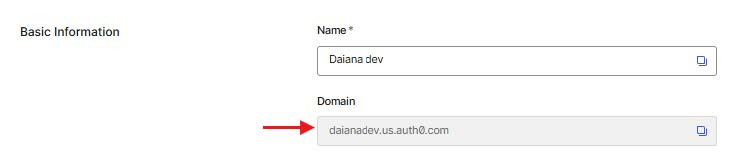

(Single Sign On) en maquinas virtuales de daiana

## Introducción
En esta documentación se encuentra el paso a paso para poder implementar correctamente el login atraves del SSO de supabase.


### Guia de referencia
https://calvincchan.com/blog/self-hosted-supabase-enable-sso

### Prerequisitos:
- Credenciales de la maquina virtual donde ingresaremos
- Supabase selfhosting

## Enable SAML in supabase:

1. En una consola debemos crear una private_key la cual nos servirá como clave para nuestro SSO en supabase, con el siguiente comando se creara en el directorio donde estamos en la consola un archivo : private_key :

openssl genpkey -algorithm rsa -outform DER -out private_key.der




2. En el mismo directorio donde se creo el archivo ponemos el siguiente comando, el cual creare un archivo .txt que contiene la clave del private_key:

openssl base64 -in private_key.der -out private_key_base64.txt




3. Ahora desde nuestro portainer nos dirigimos a stacks>Supabase>Editor . En nuestro editor buscamos la parte de auth en donde el container_name sea : supabase-auth y agregamos estas dos variables :

GOTRUE_SAML_ENABLED: “true”
GOTRUE_SAML_PRIVATE_KEY: (key del archivo txt)


## Exponer SAML endpoints en Kong.ym 
En este paso debemos ingresar a la maquina virtual y en el archivo Kong.yml y nginx.config agregar dos bloques de configuraciones a fin de que nuestro supabase tenga los endpoints correctos para dirigir a los usuarios. En este caso para modificar los archivos desde dentro la consola recomiendo usar “Remote – SSH”, una extensión de Visual studio que permite ingresar a la maquina virtual y explorar los archivos.


Una vez nos encontramos dentro de la vm debemos buscar el archivo Kong. yaml y agregar esta configuración al final de las configuraciones previas ya agregadas:

```
name: auth-v1-open-sso-acs
url: “http://auth:9999/sso/saml/acs”
routes:
- name: auth-v1-open-sso-acs
strip_path: true
paths:
- /auth/v1/sso/saml/acs
- /sso/saml/acs plugins:
- name: cors
- name: auth-v1-open-sso-metadata
url: “http://auth:9999/sso/saml/metadata”
routes:
- name: auth-v1-open-sso-metadata
strip_path: true
paths:
- /auth/v1/sso/saml/metadata
plugins:
- name: cors
```
Guía de Uso : Consola de Entrenamiento DAIANA


(Respetar la identacion para el correcto funcionamiento, puedes copiar el código del link de la guía de referencia).

Lo mismo debemos hacer en el archivo nginx.config agregando esto :


```
location ~ ^/sso/(.*)$ {
proxy_set_header Host $host;
proxy_pass http://kong;
proxy_redirect off;
}
```


Una vez realizados estos pasos desde la consola, en la cual debemos estar dentro de nuestra vm debemos realizar la siguiente request :

```
API_KEY=(tu supabase service role key , que se encuentra en los envs del
backend);
curl -X GET http://localhost:8000/auth/v1/settings \
-H ‘APIKey: ‘”$API_KEY”’’ \
-H ‘Authorization: Bearer ‘”$API_KEY”’’;
```

Si la configuración esta correcta y seguiste los pasos , debe salir:
“saml_enabled”: true


## Agregar auth0 como proveedor de itendidad de SAML:
1. En Auth0, vaya a Aplicaciones > Aplicaciones > Crear aplicación. Seleccione “Aplicaciones web de una sola página” como tipo de aplicación. Luego, haga clic en “Crear”. (En el caso que tengas una aplicación creada este paso se puede saltear )

2. En la página siguiente, seleccione la pestaña “Configuración”. En “URL de devolución de llamadas permitidas”, agregue la siguiente URL según su implementación

- Para prueba local: http://localhost:8000/sso/saml/acs
- Para producción: https://yourdomain.com/sso/saml/acs


En allowed Callback URLs va el link que dirige a la base de datos del ambiente, y en allowed Web Origins es el puerto en el que se encuentra el supabase-auth , recomiendo chequear en que puerto corre para poder configurarlo correctamente con el comando “sudo docker ps”.

3. En la misma página y en la misma pestaña “Configuración”, desplácese hasta “Configuración avanzada” y haga clic en “Endpoints”. Copie la “URL de metadatos SAML” en el portapapeles.


4. En su terminal, ejecute el siguiente comando para agregar el proveedor de identidad SAML a Supabase:

```
API_KEY=(your supabase service role key);curl -X POST http://localhost:8000/
auth/v1/admin/sso/providers \ -H ‘APIKey: ‘”$API_KEY”’’ \ -H ‘Authorization:
Bearer ‘”$API_KEY”’’ \ -H ‘Content-Type: application/json’ \ -d ‘{ “type”: “saml”,
“metadata_url”: “(paste the SAML Metadata URL here)”, “domains”: [“yourdomain.
auth0.com”] }’;
```

En esta parte debemos modificar el domain con el domain nuestro de nuestra aplicación de auth0 ejemplo del domain del ambiente dev: “domains”: [“daianadev.us.auth0.com”]




Para poder verificar si agregamos correctamente el domain de nuestro auth0 debemos ejecutar el siguiente request

```
API_KEY=(your supabase service role key);curl -X GET http://localhost:8000/
auth/v1/admin/sso/providers \ -H ‘APIKey: ‘”$API_KEY”’’ \ -H ‘Authorization:
Bearer ‘”$API_KEY”’’
```


Si el valor de domains es el que pusimos en el paso anterior, esta correctamente
configurado. En caso de que sea diferente se puede usar el siguiente link para
poder editar el Domain .

```
{host}/auth/v1/admin/sso/providers/{id}
POST {host}/auth/v1/admin/sso/providers/2a4a40ba-67a7-4827-930b-5712356a5e66
{
“domains”: [“somedomain.com”]
}
```


## Paso final :
Después de seguir los pasos anteriores, su instancia de Supabase debería admitir el inicio de sesión mediante SSO. Puede probarlo mediante la siguiente llamada API:

```
curl -v -X POST http://localhost:7000/auth/v1/sso -H ‘APIKey: ‘”$API_KEY”’’ -H ‘Authorization:
Bearer ‘”$API_KEY”’’ -H ‘Content-Type: application/json’ -d ‘{“domain”: “daianadev.
us.auth0.com”, “skip_http_redirect”: true}’
```
debe responder una URL con esta estructura


Si la request envia esta url, su provider de SSO esta correctamente configurado.


## Referencias:

- Problema de GitHub de Supabase sobre la habilitación de SAML https://github.com/supabase/cli/issues/1335

- Documentación de la API de GoTrue para administrar el IdP de SAML https://github.com/subabase/gotrue/blob/master/openapi.yaml#L1441-L1608
- Cliente Javascript de Supabase https://supabase.com/docs/reference/javascript/auth-signinwithsso