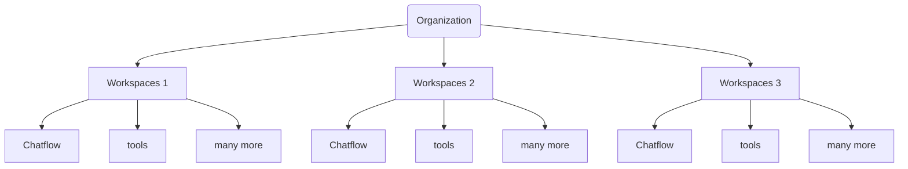

Al iniciar sesión por primera vez, se generará automáticamente un espacio de trabajo predeterminado para el usuario. Los espacios de trabajo sirven para **dividir los recursos** entre diversos equipos o unidades de negocio.

Dentro de cada espacio de trabajo, se utiliza el **Control de Acceso Basado en Roles (RBAC)** para gestionar los permisos y el acceso, garantizando que los usuarios solo tengan entrada a los recursos y configuraciones necesarios para su función.

---

## Conceptos clave incluidos:

- **Partition resources**: Dividir o particionar recursos.

- **RBAC**: Es el estándar técnico para decir que los permisos dependen del "puesto" o "rol" del usuario.

- **Default workspace**: Espacio de trabajo por defecto o predeterminado.

## Configuración de la Cuenta de Administrador
Por defecto, una nueva instalación de **DAIANA Studio** requerirá la configuración de un administrador, de forma similar a cómo se debe configurar un **usuario raíz (root)** para una base de datos al inicio.

:::::tip Notas de interés
- **Admin setup**: Configuración de administrador.
- **Root user**: Usuario raíz. Es el término técnico estándar para el usuario con máximos privilegios.
- **Initially**: Se traduce como "al inicio" o "inicialmente" para que la lectura sea más fluida.
:::::

Una vez finalizada la configuración, el usuario será dirigido al **panel de control (dashboard)** de DAIANA Studio.

En la **barra lateral izquierda**, verás la sección de **Gestión de Usuarios y Espacios de Trabajo.** Se habrá creado automáticamente un espacio de trabajo predeterminado.

## Creación de un Espacio de Trabajo

Para crear un nuevo Espacio de Trabajo (Workspace), haz clic en **Añadir Nuevo (Add New)**:

Te verás a ti mismo añadido como el **Administrador de la Organización** en el espacio de trabajo que creaste.

Para invitar a nuevos usuarios al espacio de trabajo, primero debes crear un Rol.

## Creación de un Rol

Navega hasta **Roles** en la barra lateral izquierda y haz clic en **Añadir Rol (Add Role)**:

El usuario puede especificar un control detallado (granular) de los permisos para cada recurso. Las únicas excepciones son los recursos en **Gestión de Usuarios y Espacios de Trabajo** (Roles, Usuarios, Espacios de Trabajo, Actividad de Inicio de Sesión), los cuales solo están disponibles para el **Administrador de la Cuenta** por ahora.

## Invitar Usuario

Navega a **Usuarios** en la barra lateral izquierda; te verás a ti mismo como el **administrador de la cuenta**. Esto se indica mediante el icono de persona con una estrella:

Haz clic en **Invitar Usuario (Invite User)** e introduce el correo electrónico que deseas invitar, el espacio de trabajo que se le asignará y también el rol.

Haz clic en **Enviar Invitación (Send Invite)**. El correo electrónico invitado recibirá una invitación:

Al hacer clic en el enlace de invitación, el usuario invitado será dirigido a una página de **Registro (Sign Up)**.

Después de registrarse e iniciar sesión como usuario invitado, estarás en el espacio de trabajo asignado y no aparecerá la sección de **Gestión de Usuarios y Espacios de Trabajo**:

Si has sido invitado a múltiples espacios de trabajo, puedes cambiar a uno diferente desde el botón desplegable en **la parte superior derecha**. En este caso, estamos asignados al Workspace 2 con permisos de **solo lectura**.

Podrás notar que el botón **Añadir Nuevo (Add New)** para Chatflow ya no es visible. Esto garantiza que el usuario solo pueda visualizar, y no crear, actualizar ni eliminar. Las mismas reglas de **RBAC (Control de Acceso Basado en Roles)** se aplican también para la API.

Ahora, de vuelta como **Administrador de la Cuenta**, podrás ver a los usuarios invitados, su estado, sus roles y su espacio de trabajo activo:

El administrador de la cuenta también puede modificar la configuración de otros usuarios:

## Actividad de Inicio de Sesión (Login Activity)

El administrador podrá ver cada inicio y cierre de sesión de todos los usuarios: 
## Creación de elementos en el Espacio de Trabajo

Cada elemento creado en un espacio de trabajo está **aislado** de los demás espacios de trabajo. Los espacios de trabajo son una forma de agrupar lógicamente a los usuarios y los recursos dentro de una organización, garantizando l**ímites de confianza independientes** para la gestión de recursos y el control de acceso. Se recomienda crear espacios de trabajo distintos para cada equipo.

Aquí, creamos un **Chatflow** llamado Chatflow1 dentro del Workspace1:

Cuando cambiamos al **Workspace2**, el Chatflow1 no será visible. Esto se aplica a todos los recursos, tales como **Agentflows**, **Herramientas (Tools)**, **Asistentes**, etc.

El siguiente diagrama ilustra la relación entre las organizaciones, los espacios de trabajo y los diversos recursos asociados y contenidos dentro de un espacio de trabajo.

## Eliminar un Espacio de Trabajo

Actualmente, solo el **Administrador de la Cuenta** puede eliminar espacios de trabajo. Por defecto, no es posible eliminar un espacio de trabajo si todavía hay usuarios dentro de dicho espacio.

Primero deberás desvincular a todos los usuarios invitados. Esto ofrece flexibilidad en caso de que solo desees eliminar a ciertos usuarios de un espacio de trabajo. Ten en cuenta que el **Propietario de la Organización** que creó el espacio de trabajo no puede ser desvinculado del mismo.

Después de desvincular a los usuarios invitados, cuando el único usuario que queda en el espacio de trabajo es el **Propietario de la Organización**, el botón de eliminar ya estará habilitado: 

Eliminar un espacio de trabajo es una **acción irreversible** y provocará la eliminación en cascada de todos los elementos dentro de ese espacio. Verás un cuadro de advertencia:

Después de eliminar un espacio de trabajo, el usuario regresará al Espacio de Trabajo Predeterminado (Default workspace). El espacio de trabajo predeterminado que se creó automáticamente al inicio no se puede eliminar.